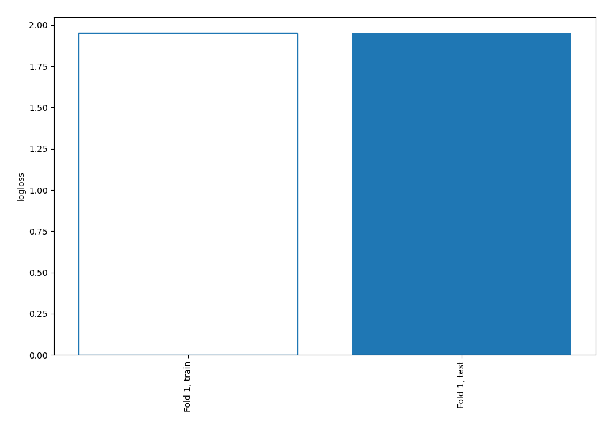
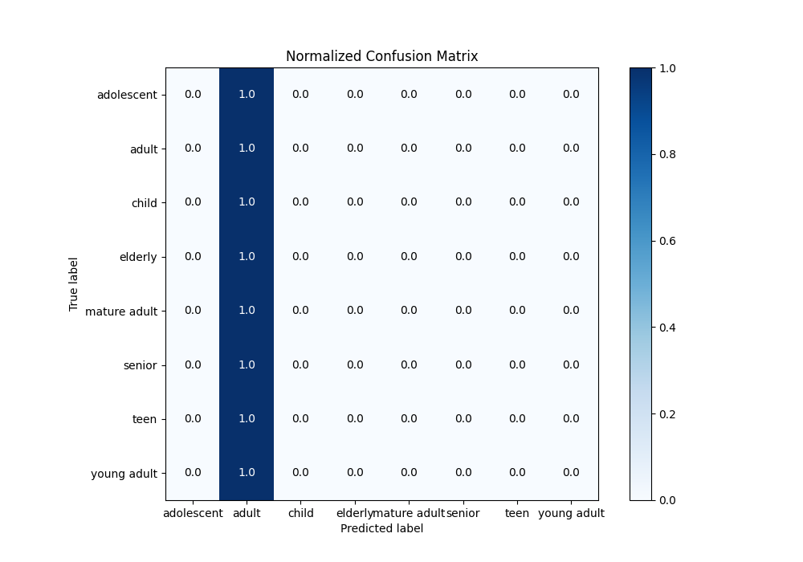
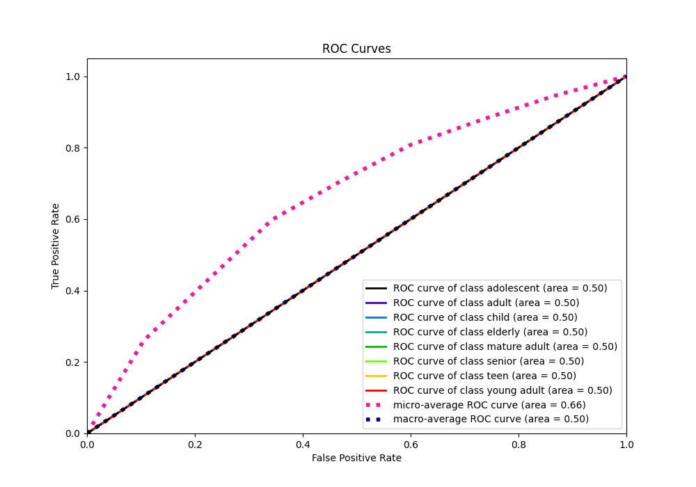
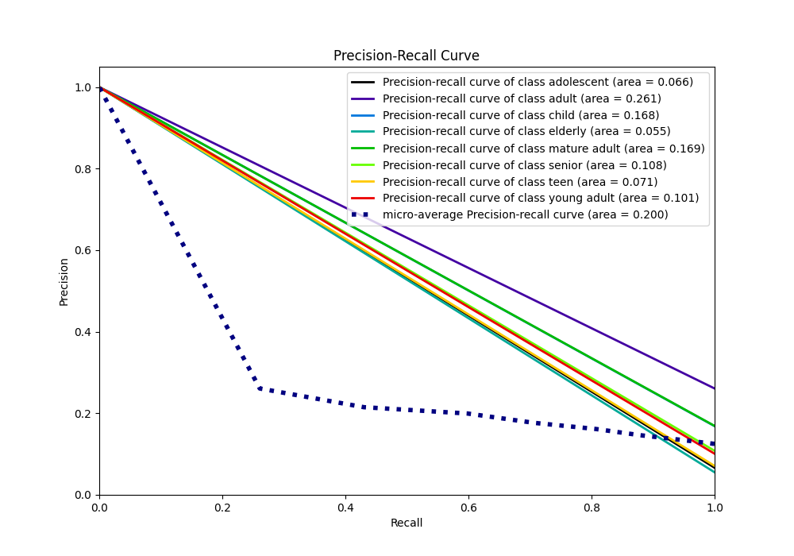

# Summary of 1_Baseline

[<< Go back](../README.md)

## Baseline Classifier (Baseline)
- **n_jobs**: -1
- **num_class**: 8
- **explain_level**: 2

## Validation
 - **validation_type**: split
 - **train_ratio**: 0.75
 - **shuffle**: True
 - **stratify**: True

## Optimized metric
logloss

## Training time

1.4 seconds

### Metric details
|           |   adolescent |       adult |   child |   elderly |   mature adult |   senior |   teen |   young adult |   accuracy |     macro avg |   weighted avg |   logloss |
|:----------|-------------:|------------:|--------:|----------:|---------------:|---------:|-------:|--------------:|-----------:|--------------:|---------------:|----------:|
| precision |            0 |    0.260853 |       0 |         0 |              0 |        0 |      0 |             0 |   0.260853 |     0.0326067 |      0.0680445 |   1.95083 |
| recall    |            0 |    1        |       0 |         0 |              0 |        0 |      0 |             0 |   0.260853 |     0.125     |      0.260853  |   1.95083 |
| f1-score  |            0 |    0.413773 |       0 |         0 |              0 |        0 |      0 |             0 |   0.260853 |     0.0517216 |      0.107934  |   1.95083 |
| support   |         1246 | 4891        |    3159 |      1036 |           3171 |     2025 |   1331 |          1891 |   0.260853 | 18750         |  18750         |   1.95083 |

## Confusion matrix
|                         |   Predicted as adolescent |   Predicted as adult |   Predicted as child |   Predicted as elderly |   Predicted as mature adult |   Predicted as senior |   Predicted as teen |   Predicted as young adult |
|:------------------------|--------------------------:|---------------------:|---------------------:|-----------------------:|----------------------------:|----------------------:|--------------------:|---------------------------:|
| Labeled as adolescent   |                         0 |                 1246 |                    0 |                      0 |                           0 |                     0 |                   0 |                          0 |
| Labeled as adult        |                         0 |                 4891 |                    0 |                      0 |                           0 |                     0 |                   0 |                          0 |
| Labeled as child        |                         0 |                 3159 |                    0 |                      0 |                           0 |                     0 |                   0 |                          0 |
| Labeled as elderly      |                         0 |                 1036 |                    0 |                      0 |                           0 |                     0 |                   0 |                          0 |
| Labeled as mature adult |                         0 |                 3171 |                    0 |                      0 |                           0 |                     0 |                   0 |                          0 |
| Labeled as senior       |                         0 |                 2025 |                    0 |                      0 |                           0 |                     0 |                   0 |                          0 |
| Labeled as teen         |                         0 |                 1331 |                    0 |                      0 |                           0 |                     0 |                   0 |                          0 |
| Labeled as young adult  |                         0 |                 1891 |                    0 |                      0 |                           0 |                     0 |                   0 |                          0 |

## Learning curves

## Confusion Matrix

## Normalized Confusion Matrix

## ROC Curve

## Precision Recall Curve

[<< Go back](../README.md)
