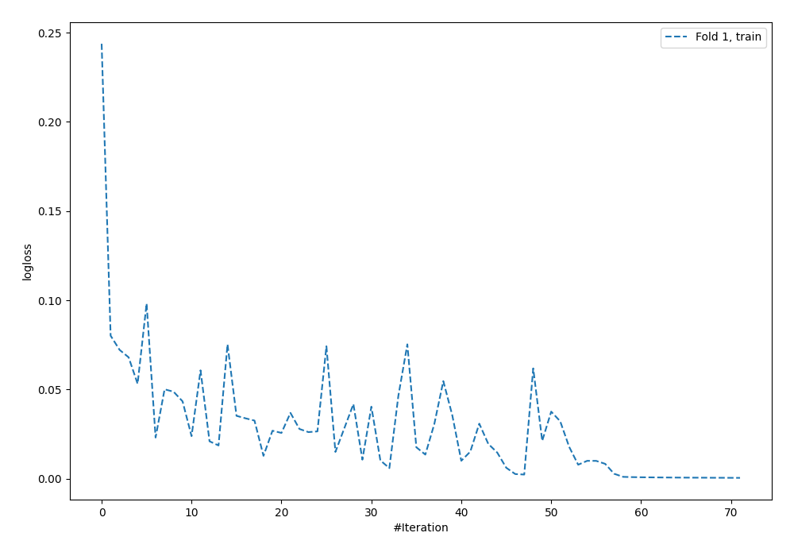
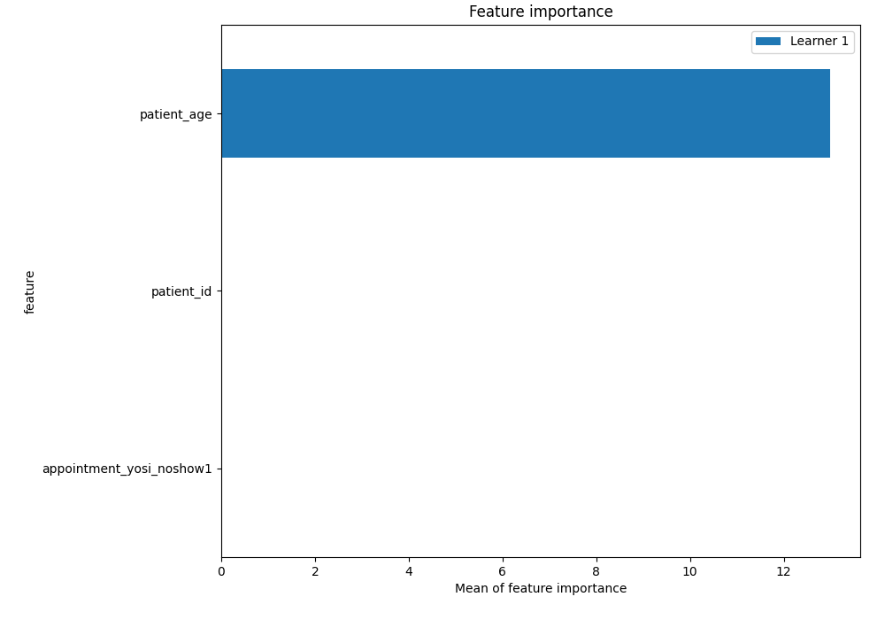
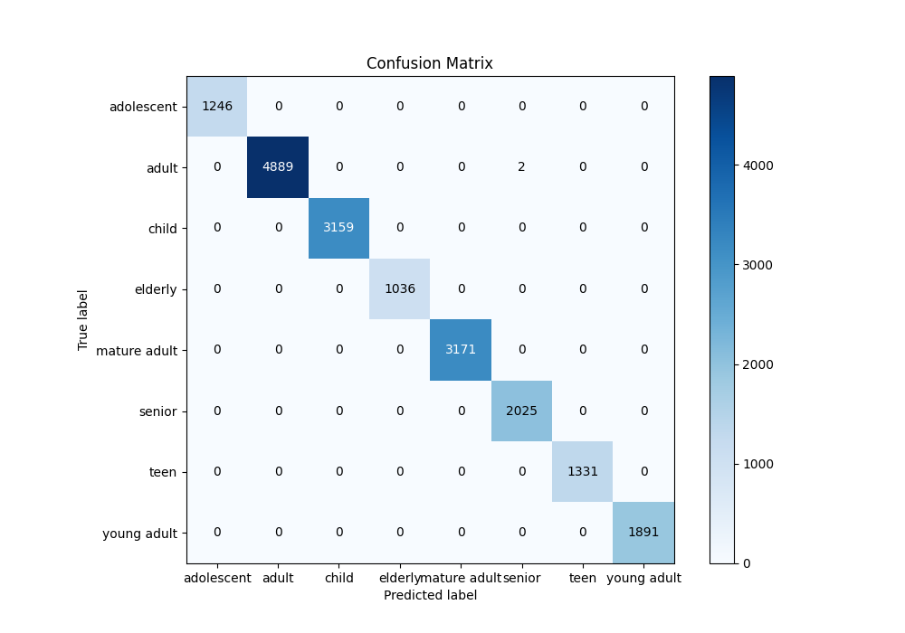
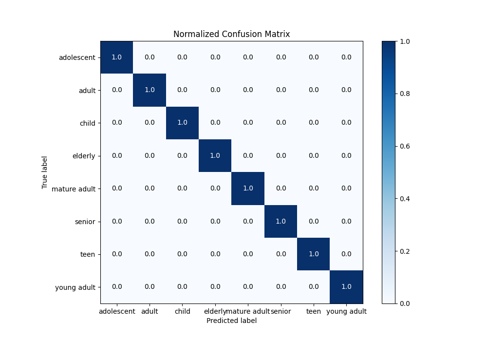
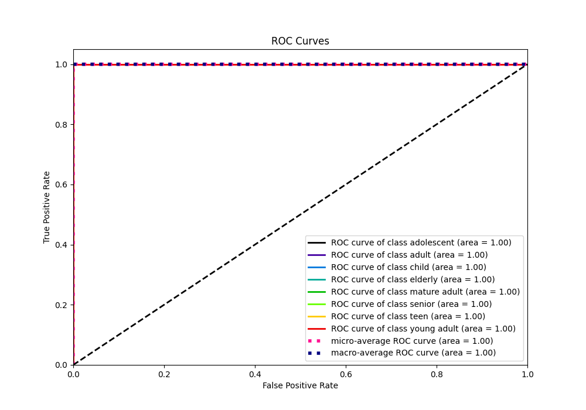
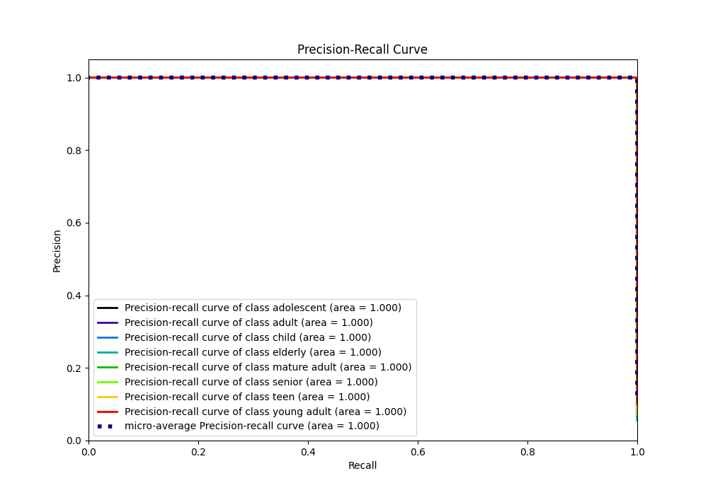

# Summary of 4_Default_NeuralNetwork

[<< Go back](../README.md)

## Neural Network
- **n_jobs**: -1
- **dense_1_size**: 32
- **dense_2_size**: 16
- **learning_rate**: 0.05
- **num_class**: 8
- **explain_level**: 2

## Validation
 - **validation_type**: split
 - **train_ratio**: 0.75
 - **shuffle**: True
 - **stratify**: True

## Optimized metric
logloss

## Training time

6.7 seconds

### Metric details
|           |   adolescent |       adult |   child |   elderly |   mature adult |      senior |   teen |   young adult |   accuracy |    macro avg |   weighted avg |    logloss |
|:----------|-------------:|------------:|--------:|----------:|---------------:|------------:|-------:|--------------:|-----------:|-------------:|---------------:|-----------:|
| precision |            1 |    1        |       1 |         1 |              1 |    0.999013 |      1 |             1 |   0.999893 |     0.999877 |       0.999893 | 0.00305178 |
| recall    |            1 |    0.999591 |       1 |         1 |              1 |    1        |      1 |             1 |   0.999893 |     0.999949 |       0.999893 | 0.00305178 |
| f1-score  |            1 |    0.999796 |       1 |         1 |              1 |    0.999506 |      1 |             1 |   0.999893 |     0.999913 |       0.999893 | 0.00305178 |
| support   |         1246 | 4891        |    3159 |      1036 |           3171 | 2025        |   1331 |          1891 |   0.999893 | 18750        |   18750        | 0.00305178 |

## Confusion matrix
|                         |   Predicted as adolescent |   Predicted as adult |   Predicted as child |   Predicted as elderly |   Predicted as mature adult |   Predicted as senior |   Predicted as teen |   Predicted as young adult |
|:------------------------|--------------------------:|---------------------:|---------------------:|-----------------------:|----------------------------:|----------------------:|--------------------:|---------------------------:|
| Labeled as adolescent   |                      1246 |                    0 |                    0 |                      0 |                           0 |                     0 |                   0 |                          0 |
| Labeled as adult        |                         0 |                 4889 |                    0 |                      0 |                           0 |                     2 |                   0 |                          0 |
| Labeled as child        |                         0 |                    0 |                 3159 |                      0 |                           0 |                     0 |                   0 |                          0 |
| Labeled as elderly      |                         0 |                    0 |                    0 |                   1036 |                           0 |                     0 |                   0 |                          0 |
| Labeled as mature adult |                         0 |                    0 |                    0 |                      0 |                        3171 |                     0 |                   0 |                          0 |
| Labeled as senior       |                         0 |                    0 |                    0 |                      0 |                           0 |                  2025 |                   0 |                          0 |
| Labeled as teen         |                         0 |                    0 |                    0 |                      0 |                           0 |                     0 |                1331 |                          0 |
| Labeled as young adult  |                         0 |                    0 |                    0 |                      0 |                           0 |                     0 |                   0 |                       1891 |

## Learning curves

## Permutation-based Importance

## Confusion Matrix

## Normalized Confusion Matrix

## ROC Curve

## Precision Recall Curve

[<< Go back](../README.md)
