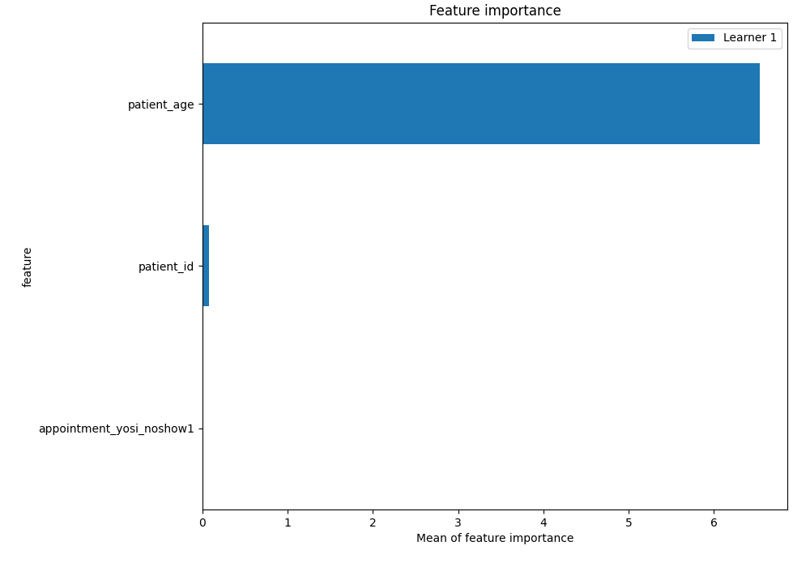
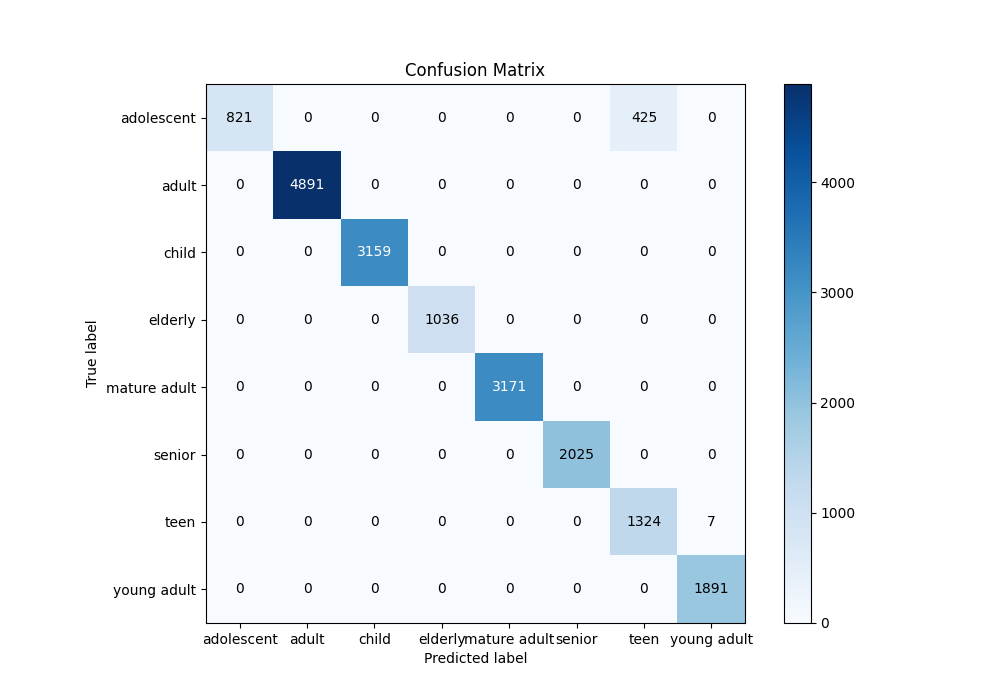
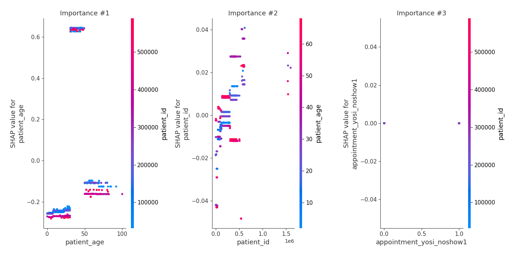
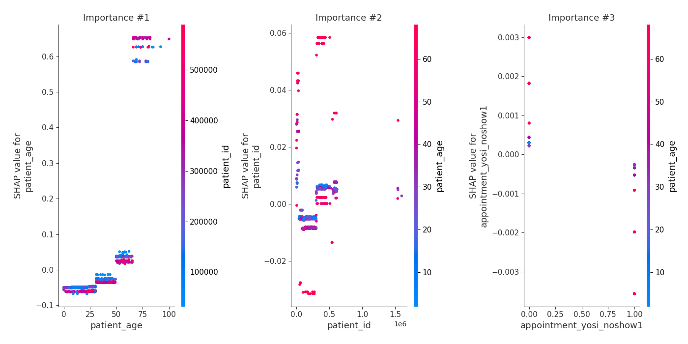

# Summary of 5_Default_RandomForest

[<< Go back](../README.md)

## Random Forest
- **n_jobs**: -1
- **criterion**: gini
- **max_features**: 0.9
- **min_samples_split**: 30
- **max_depth**: 4
- **eval_metric_name**: logloss
- **num_class**: 8
- **explain_level**: 2

## Validation
 - **validation_type**: split
 - **train_ratio**: 0.75
 - **shuffle**: True
 - **stratify**: True

## Optimized metric
logloss

## Training time

6.2 seconds

### Metric details
|           |   adolescent |   adult |   child |   elderly |   mature adult |   senior |        teen |   young adult |   accuracy |    macro avg |   weighted avg |   logloss |
|:----------|-------------:|--------:|--------:|----------:|---------------:|---------:|------------:|--------------:|-----------:|-------------:|---------------:|----------:|
| precision |     1        |       1 |       1 |         1 |              1 |        1 |    0.757004 |      0.996312 |    0.97696 |     0.969164 |       0.982379 |  0.355845 |
| recall    |     0.658909 |       1 |       1 |         1 |              1 |        1 |    0.994741 |      1        |    0.97696 |     0.956706 |       0.97696  |  0.355845 |
| f1-score  |     0.794388 |       1 |       1 |         1 |              1 |        1 |    0.85974  |      0.998153 |    0.97696 |     0.956535 |       0.976194 |  0.355845 |
| support   |  1246        |    4891 |    3159 |      1036 |           3171 |     2025 | 1331        |   1891        |    0.97696 | 18750        |   18750        |  0.355845 |

## Confusion matrix
|                         |   Predicted as adolescent |   Predicted as adult |   Predicted as child |   Predicted as elderly |   Predicted as mature adult |   Predicted as senior |   Predicted as teen |   Predicted as young adult |
|:------------------------|--------------------------:|---------------------:|---------------------:|-----------------------:|----------------------------:|----------------------:|--------------------:|---------------------------:|
| Labeled as adolescent   |                       821 |                    0 |                    0 |                      0 |                           0 |                     0 |                 425 |                          0 |
| Labeled as adult        |                         0 |                 4891 |                    0 |                      0 |                           0 |                     0 |                   0 |                          0 |
| Labeled as child        |                         0 |                    0 |                 3159 |                      0 |                           0 |                     0 |                   0 |                          0 |
| Labeled as elderly      |                         0 |                    0 |                    0 |                   1036 |                           0 |                     0 |                   0 |                          0 |
| Labeled as mature adult |                         0 |                    0 |                    0 |                      0 |                        3171 |                     0 |                   0 |                          0 |
| Labeled as senior       |                         0 |                    0 |                    0 |                      0 |                           0 |                  2025 |                   0 |                          0 |
| Labeled as teen         |                         0 |                    0 |                    0 |                      0 |                           0 |                     0 |                1324 |                          7 |
| Labeled as young adult  |                         0 |                    0 |                    0 |                      0 |                           0 |                     0 |                   0 |                       1891 |

## Learning curves

## Permutation-based Importance

## Confusion Matrix

## Normalized Confusion Matrix

## ROC Curve

## Precision Recall Curve

## SHAP Importance

## SHAP Dependence plots

### Dependence adolescent (Fold 1)

### Dependence adult (Fold 1)

### Dependence child (Fold 1)

### Dependence elderly (Fold 1)

### Dependence mature adult (Fold 1)

### Dependence senior (Fold 1)

### Dependence teen (Fold 1)

### Dependence young adult (Fold 1)

## SHAP Decision plots

### Worst decisions for selected sample 1 (Fold 1)

### Worst decisions for selected sample 2 (Fold 1)

### Worst decisions for selected sample 3 (Fold 1)

### Worst decisions for selected sample 4 (Fold 1)

### Best decisions for selected sample 1 (Fold 1)

### Best decisions for selected sample 2 (Fold 1)

### Best decisions for selected sample 3 (Fold 1)

### Best decisions for selected sample 4 (Fold 1)

[<< Go back](../README.md)
