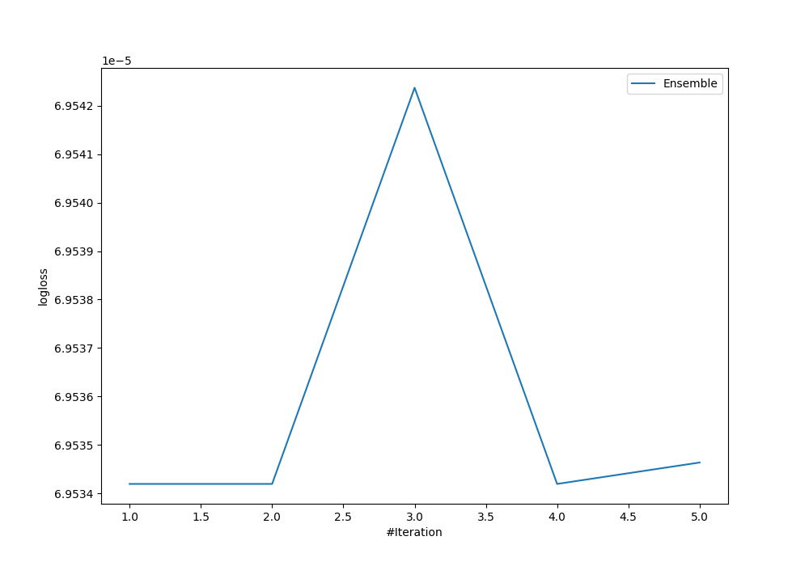
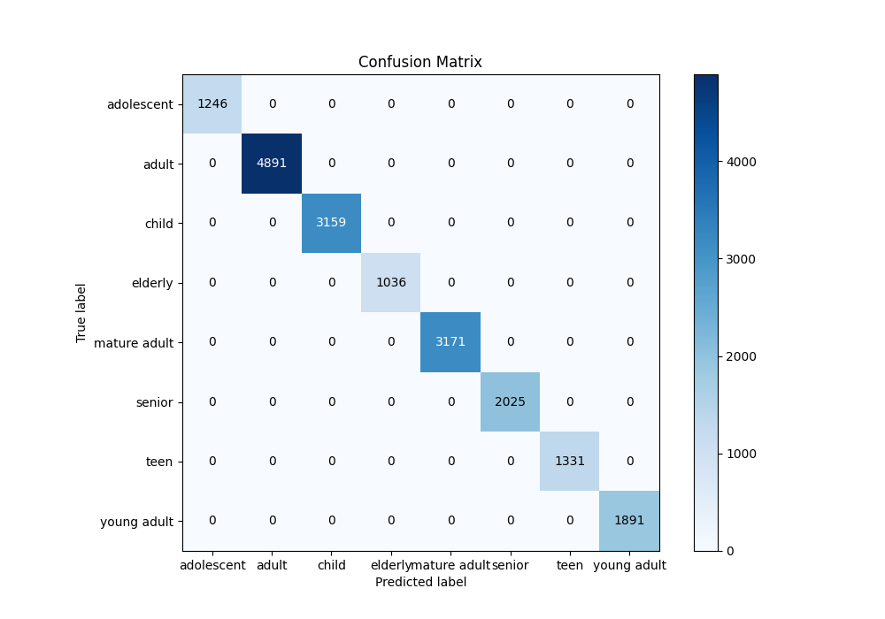
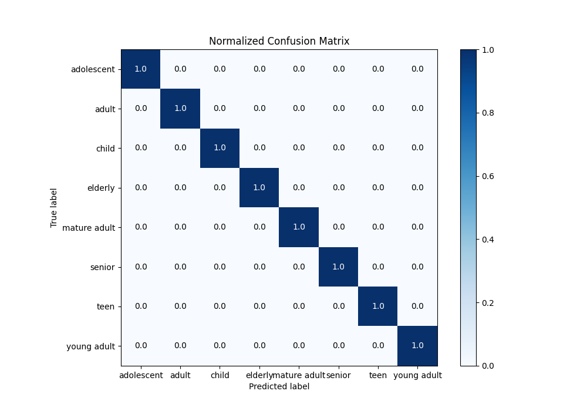
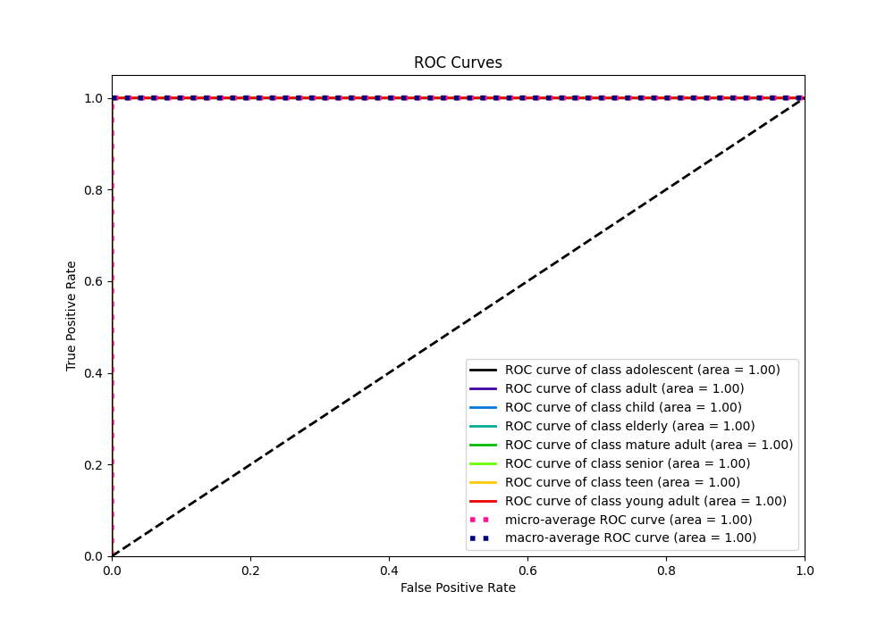
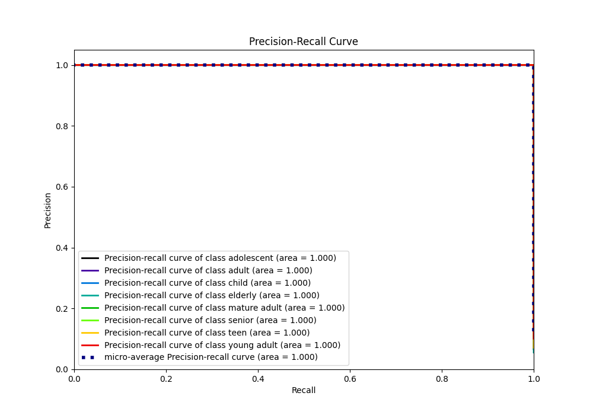

# Summary of Ensemble

[<< Go back](../README.md)

## Ensemble structure
| Model             |   Weight |
|:------------------|---------:|
| 3_Default_Xgboost |        1 |

### Metric details
|           |   adolescent |   adult |   child |   elderly |   mature adult |   senior |   teen |   young adult |   accuracy |   macro avg |   weighted avg |     logloss |
|:----------|-------------:|--------:|--------:|----------:|---------------:|---------:|-------:|--------------:|-----------:|------------:|---------------:|------------:|
| precision |            1 |       1 |       1 |         1 |              1 |        1 |      1 |             1 |          1 |           1 |              1 | 6.95342e-05 |
| recall    |            1 |       1 |       1 |         1 |              1 |        1 |      1 |             1 |          1 |           1 |              1 | 6.95342e-05 |
| f1-score  |            1 |       1 |       1 |         1 |              1 |        1 |      1 |             1 |          1 |           1 |              1 | 6.95342e-05 |
| support   |         1246 |    4891 |    3159 |      1036 |           3171 |     2025 |   1331 |          1891 |          1 |       18750 |          18750 | 6.95342e-05 |

## Confusion matrix
|                         |   Predicted as adolescent |   Predicted as adult |   Predicted as child |   Predicted as elderly |   Predicted as mature adult |   Predicted as senior |   Predicted as teen |   Predicted as young adult |
|:------------------------|--------------------------:|---------------------:|---------------------:|-----------------------:|----------------------------:|----------------------:|--------------------:|---------------------------:|
| Labeled as adolescent   |                      1246 |                    0 |                    0 |                      0 |                           0 |                     0 |                   0 |                          0 |
| Labeled as adult        |                         0 |                 4891 |                    0 |                      0 |                           0 |                     0 |                   0 |                          0 |
| Labeled as child        |                         0 |                    0 |                 3159 |                      0 |                           0 |                     0 |                   0 |                          0 |
| Labeled as elderly      |                         0 |                    0 |                    0 |                   1036 |                           0 |                     0 |                   0 |                          0 |
| Labeled as mature adult |                         0 |                    0 |                    0 |                      0 |                        3171 |                     0 |                   0 |                          0 |
| Labeled as senior       |                         0 |                    0 |                    0 |                      0 |                           0 |                  2025 |                   0 |                          0 |
| Labeled as teen         |                         0 |                    0 |                    0 |                      0 |                           0 |                     0 |                1331 |                          0 |
| Labeled as young adult  |                         0 |                    0 |                    0 |                      0 |                           0 |                     0 |                   0 |                       1891 |

## Learning curves

## Confusion Matrix

## Normalized Confusion Matrix

## ROC Curve

## Precision Recall Curve

[<< Go back](../README.md)
