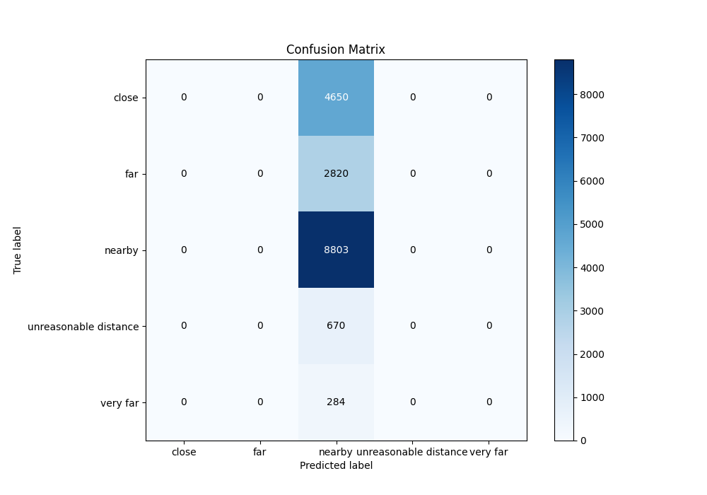
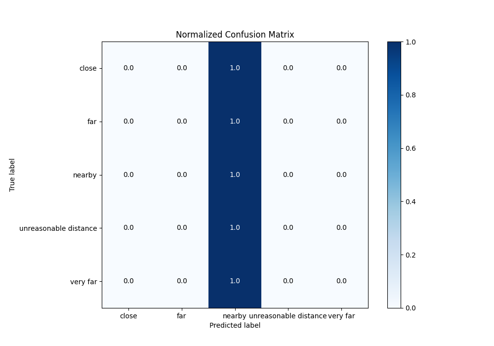

# Summary of 1_Baseline

[<< Go back](../README.md)

## Baseline Classifier (Baseline)
- **n_jobs**: -1
- **num_class**: 5
- **explain_level**: 2

## Validation
 - **validation_type**: split
 - **train_ratio**: 0.75
 - **shuffle**: True
 - **stratify**: True

## Optimized metric
logloss

## Training time

0.7 seconds

### Metric details
|           |   close |   far |      nearby |   unreasonable distance |   very far |   accuracy |    macro avg |   weighted avg |   logloss |
|:----------|--------:|------:|------------:|------------------------:|-----------:|-----------:|-------------:|---------------:|----------:|
| precision |       0 |     0 |    0.511    |                       0 |          0 |      0.511 |     0.1022   |       0.261121 |   1.18678 |
| recall    |       0 |     0 |    1        |                       0 |          0 |      0.511 |     0.2      |       0.511    |   1.18678 |
| f1-score  |       0 |     0 |    0.676373 |                       0 |          0 |      0.511 |     0.135275 |       0.345627 |   1.18678 |
| support   |    4650 |  2820 | 8803        |                     670 |        284 |      0.511 | 17227        |   17227        |   1.18678 |

## Confusion matrix
|                                  |   Predicted as close |   Predicted as far |   Predicted as nearby |   Predicted as unreasonable distance |   Predicted as very far |
|:---------------------------------|---------------------:|-------------------:|----------------------:|-------------------------------------:|------------------------:|
| Labeled as close                 |                    0 |                  0 |                  4650 |                                    0 |                       0 |
| Labeled as far                   |                    0 |                  0 |                  2820 |                                    0 |                       0 |
| Labeled as nearby                |                    0 |                  0 |                  8803 |                                    0 |                       0 |
| Labeled as unreasonable distance |                    0 |                  0 |                   670 |                                    0 |                       0 |
| Labeled as very far              |                    0 |                  0 |                   284 |                                    0 |                       0 |

## Learning curves

## Confusion Matrix

## Normalized Confusion Matrix

## ROC Curve

## Precision Recall Curve

[<< Go back](../README.md)
