# Summary of 3_Default_Xgboost

[<< Go back](../README.md)

## Extreme Gradient Boosting (Xgboost)
- **n_jobs**: -1
- **objective**: multi:softprob
- **eta**: 0.075
- **max_depth**: 6
- **min_child_weight**: 1
- **subsample**: 1.0
- **colsample_bytree**: 1.0
- **eval_metric**: mlogloss
- **num_class**: 5
- **explain_level**: 2

## Validation
 - **validation_type**: split
 - **train_ratio**: 0.75
 - **shuffle**: True
 - **stratify**: True

## Optimized metric
logloss

## Training time

8.4 seconds

### Metric details
|           |       close |         far |      nearby |   unreasonable distance |   very far |   accuracy |    macro avg |   weighted avg |    logloss |
|:----------|------------:|------------:|------------:|------------------------:|-----------:|-----------:|-------------:|---------------:|-----------:|
| precision |    1        |    0.997161 |    0.999886 |                0.988113 |   0.947183 |   0.998142 |     0.986469 |       0.998144 | 0.00454643 |
| recall    |    0.99957  |    0.996454 |    1        |                0.992537 |   0.947183 |   0.998142 |     0.987149 |       0.998142 | 0.00454643 |
| f1-score  |    0.999785 |    0.996807 |    0.999943 |                0.99032  |   0.947183 |   0.998142 |     0.986808 |       0.998143 | 0.00454643 |
| support   | 4650        | 2820        | 8803        |              670        | 284        |   0.998142 | 17227        |   17227        | 0.00454643 |

## Confusion matrix
|                                  |   Predicted as close |   Predicted as far |   Predicted as nearby |   Predicted as unreasonable distance |   Predicted as very far |
|:---------------------------------|---------------------:|-------------------:|----------------------:|-------------------------------------:|------------------------:|
| Labeled as close                 |                 4648 |                  1 |                     1 |                                    0 |                       0 |
| Labeled as far                   |                    0 |               2810 |                     0 |                                    0 |                      10 |
| Labeled as nearby                |                    0 |                  0 |                  8803 |                                    0 |                       0 |
| Labeled as unreasonable distance |                    0 |                  0 |                     0 |                                  665 |                       5 |
| Labeled as very far              |                    0 |                  7 |                     0 |                                    8 |                     269 |

## Learning curves
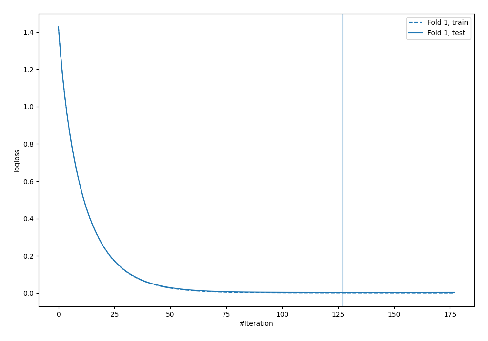

## Permutation-based Importance
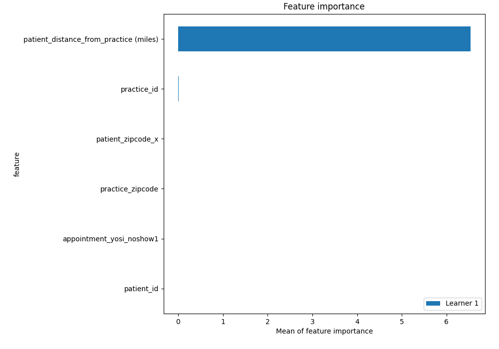
## Confusion Matrix

## Normalized Confusion Matrix

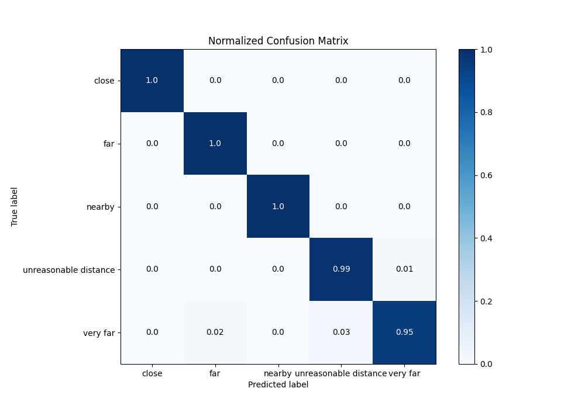

## ROC Curve

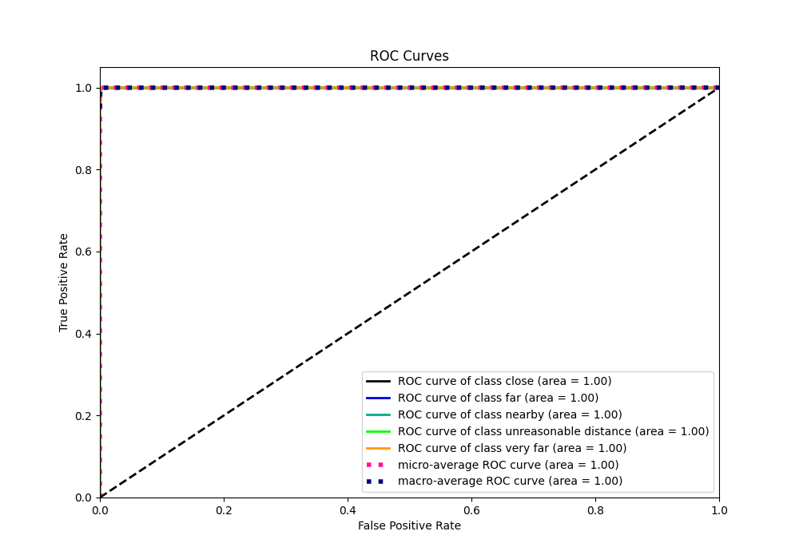

## Precision Recall Curve

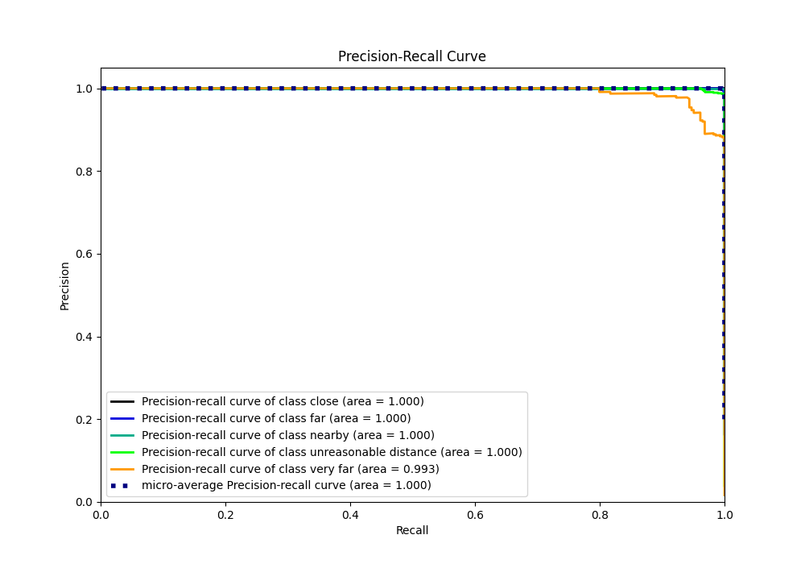

## SHAP Importance
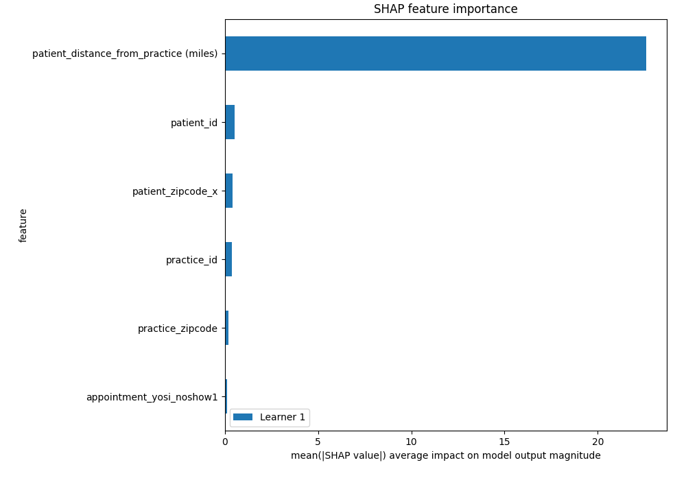

## SHAP Dependence plots

### Dependence close (Fold 1)
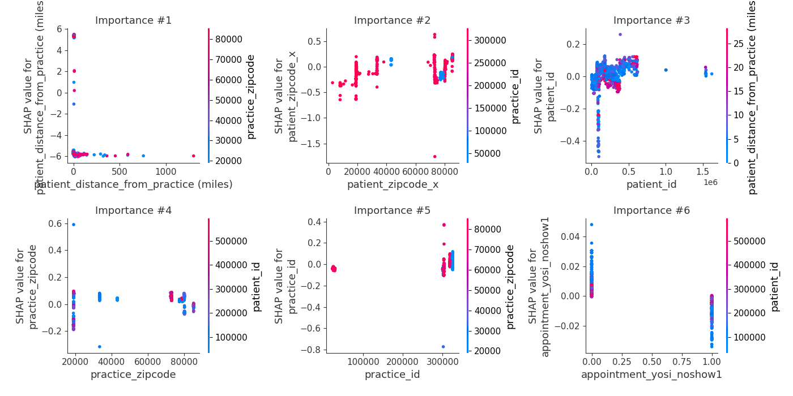
### Dependence far (Fold 1)
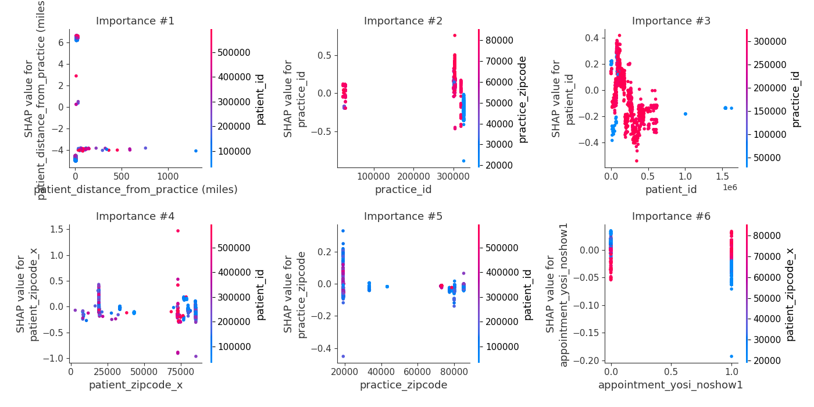
### Dependence nearby (Fold 1)
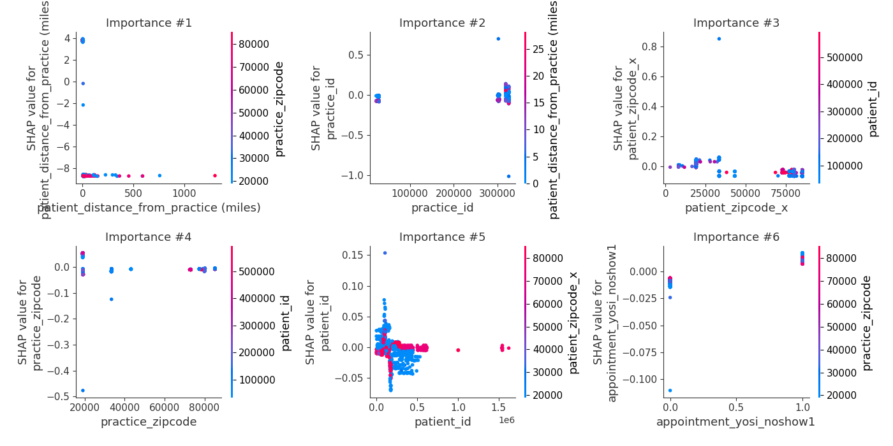
### Dependence unreasonable distance (Fold 1)
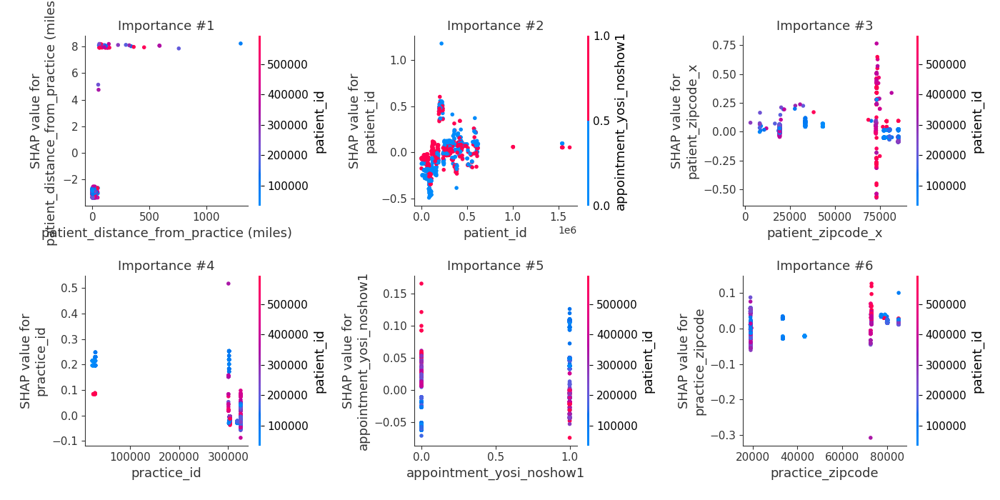
### Dependence very far (Fold 1)
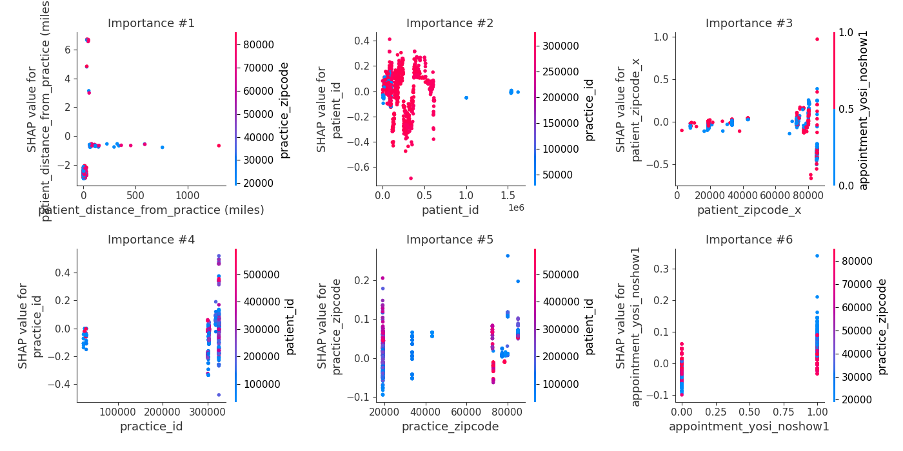

## SHAP Decision plots

### Worst decisions for selected sample 1 (Fold 1)
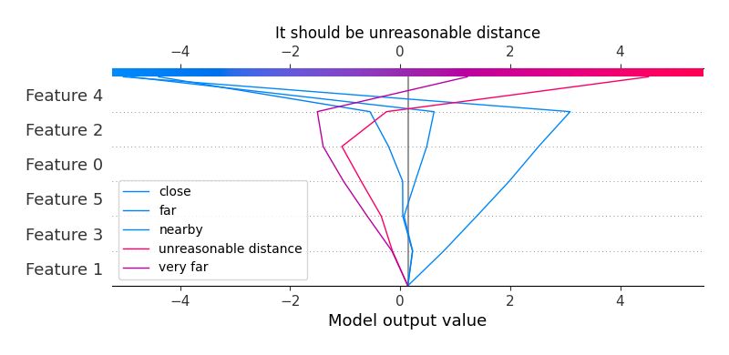
### Worst decisions for selected sample 2 (Fold 1)
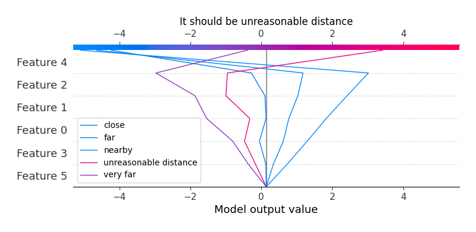
### Worst decisions for selected sample 3 (Fold 1)
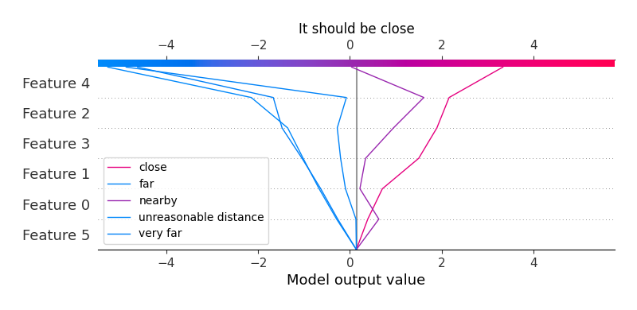
### Worst decisions for selected sample 4 (Fold 1)
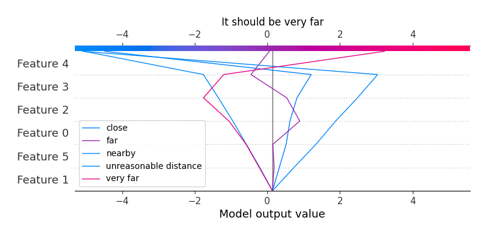
### Best decisions for selected sample 1 (Fold 1)

### Best decisions for selected sample 2 (Fold 1)

### Best decisions for selected sample 3 (Fold 1)
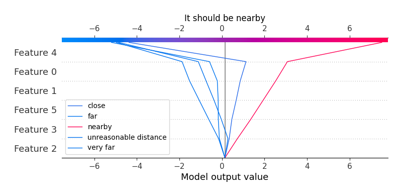
### Best decisions for selected sample 4 (Fold 1)
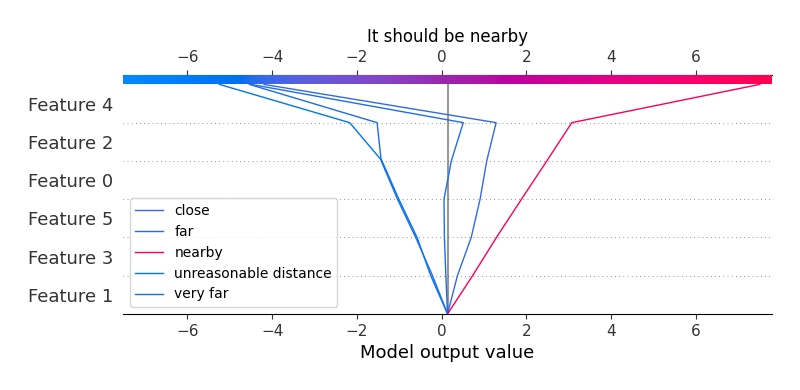

[<< Go back](../README.md)
