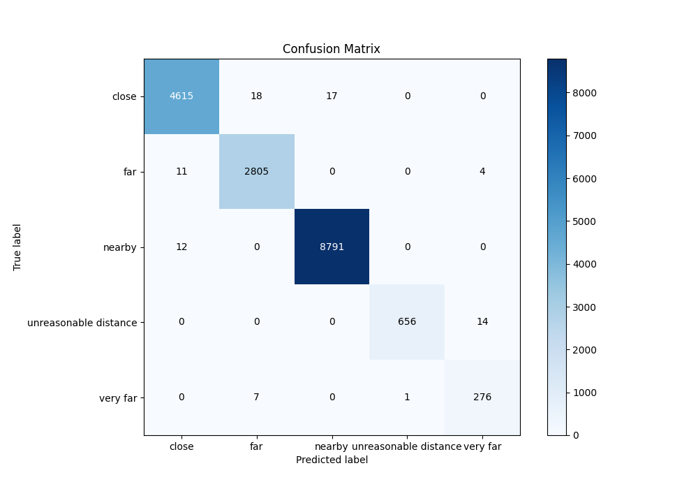

# Summary of 4_Default_NeuralNetwork

[<< Go back](../README.md)

## Neural Network
- **n_jobs**: -1
- **dense_1_size**: 32
- **dense_2_size**: 16
- **learning_rate**: 0.05
- **num_class**: 5
- **explain_level**: 2

## Validation
 - **validation_type**: split
 - **train_ratio**: 0.75
 - **shuffle**: True
 - **stratify**: True

## Optimized metric
logloss

## Training time

10.4 seconds

### Metric details
|           |       close |         far |      nearby |   unreasonable distance |   very far |   accuracy |    macro avg |   weighted avg |   logloss |
|:----------|------------:|------------:|------------:|------------------------:|-----------:|-----------:|-------------:|---------------:|----------:|
| precision |    0.995041 |    0.991166 |    0.99807  |                0.998478 |   0.938776 |   0.995124 |     0.984306 |       0.995161 | 0.0172138 |
| recall    |    0.992473 |    0.994681 |    0.998637 |                0.979104 |   0.971831 |   0.995124 |     0.987345 |       0.995124 | 0.0172138 |
| f1-score  |    0.993755 |    0.99292  |    0.998353 |                0.988696 |   0.955017 |   0.995124 |     0.985749 |       0.995133 | 0.0172138 |
| support   | 4650        | 2820        | 8803        |              670        | 284        |   0.995124 | 17227        |   17227        | 0.0172138 |

## Confusion matrix
|                                  |   Predicted as close |   Predicted as far |   Predicted as nearby |   Predicted as unreasonable distance |   Predicted as very far |
|:---------------------------------|---------------------:|-------------------:|----------------------:|-------------------------------------:|------------------------:|
| Labeled as close                 |                 4615 |                 18 |                    17 |                                    0 |                       0 |
| Labeled as far                   |                   11 |               2805 |                     0 |                                    0 |                       4 |
| Labeled as nearby                |                   12 |                  0 |                  8791 |                                    0 |                       0 |
| Labeled as unreasonable distance |                    0 |                  0 |                     0 |                                  656 |                      14 |
| Labeled as very far              |                    0 |                  7 |                     0 |                                    1 |                     276 |

## Learning curves

## Permutation-based Importance

## Confusion Matrix

## Normalized Confusion Matrix

## ROC Curve

## Precision Recall Curve

[<< Go back](../README.md)
