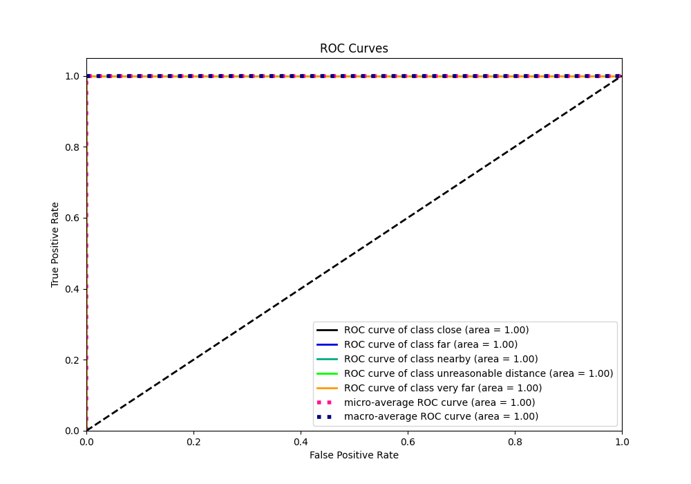

# Summary of 5_Default_RandomForest

[<< Go back](../README.md)

## Random Forest
- **n_jobs**: -1
- **criterion**: gini
- **max_features**: 0.9
- **min_samples_split**: 30
- **max_depth**: 4
- **eval_metric_name**: logloss
- **num_class**: 5
- **explain_level**: 2

## Validation
 - **validation_type**: split
 - **train_ratio**: 0.75
 - **shuffle**: True
 - **stratify**: True

## Optimized metric
logloss

## Training time

5.5 seconds

### Metric details
|           |   close |   far |   nearby |   unreasonable distance |   very far |   accuracy |    macro avg |   weighted avg |   logloss |
|:----------|--------:|------:|---------:|------------------------:|-----------:|-----------:|-------------:|---------------:|----------:|
| precision |       1 |     1 |        1 |                0.997024 |   1        |   0.999884 |     0.999405 |       0.999884 | 0.0107606 |
| recall    |       1 |     1 |        1 |                1        |   0.992958 |   0.999884 |     0.998592 |       0.999884 | 0.0107606 |
| f1-score  |       1 |     1 |        1 |                0.99851  |   0.996466 |   0.999884 |     0.998995 |       0.999884 | 0.0107606 |
| support   |    4650 |  2820 |     8803 |              670        | 284        |   0.999884 | 17227        |   17227        | 0.0107606 |

## Confusion matrix
|                                  |   Predicted as close |   Predicted as far |   Predicted as nearby |   Predicted as unreasonable distance |   Predicted as very far |
|:---------------------------------|---------------------:|-------------------:|----------------------:|-------------------------------------:|------------------------:|
| Labeled as close                 |                 4650 |                  0 |                     0 |                                    0 |                       0 |
| Labeled as far                   |                    0 |               2820 |                     0 |                                    0 |                       0 |
| Labeled as nearby                |                    0 |                  0 |                  8803 |                                    0 |                       0 |
| Labeled as unreasonable distance |                    0 |                  0 |                     0 |                                  670 |                       0 |
| Labeled as very far              |                    0 |                  0 |                     0 |                                    2 |                     282 |

## Learning curves

## Permutation-based Importance

## Confusion Matrix

## Normalized Confusion Matrix

## ROC Curve

## Precision Recall Curve

## SHAP Importance

## SHAP Dependence plots

### Dependence close (Fold 1)

### Dependence far (Fold 1)

### Dependence nearby (Fold 1)

### Dependence unreasonable distance (Fold 1)

### Dependence very far (Fold 1)

## SHAP Decision plots

### Worst decisions for selected sample 1 (Fold 1)

### Worst decisions for selected sample 2 (Fold 1)

### Worst decisions for selected sample 3 (Fold 1)

### Worst decisions for selected sample 4 (Fold 1)

### Best decisions for selected sample 1 (Fold 1)

### Best decisions for selected sample 2 (Fold 1)

### Best decisions for selected sample 3 (Fold 1)

### Best decisions for selected sample 4 (Fold 1)

[<< Go back](../README.md)
