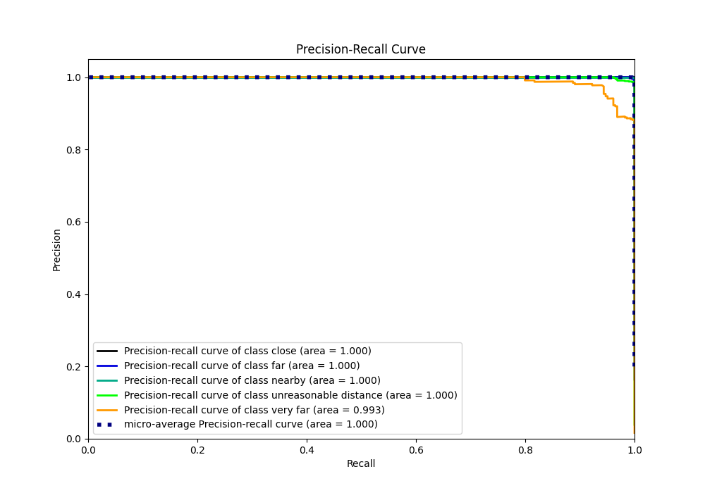

# Summary of Ensemble

[<< Go back](../README.md)

## Ensemble structure
| Model             |   Weight |
|:------------------|---------:|
| 3_Default_Xgboost |        1 |

### Metric details
|           |       close |         far |      nearby |   unreasonable distance |   very far |   accuracy |    macro avg |   weighted avg |    logloss |
|:----------|------------:|------------:|------------:|------------------------:|-----------:|-----------:|-------------:|---------------:|-----------:|
| precision |    1        |    0.997161 |    0.999886 |                0.988113 |   0.947183 |   0.998142 |     0.986469 |       0.998144 | 0.00454643 |
| recall    |    0.99957  |    0.996454 |    1        |                0.992537 |   0.947183 |   0.998142 |     0.987149 |       0.998142 | 0.00454643 |
| f1-score  |    0.999785 |    0.996807 |    0.999943 |                0.99032  |   0.947183 |   0.998142 |     0.986808 |       0.998143 | 0.00454643 |
| support   | 4650        | 2820        | 8803        |              670        | 284        |   0.998142 | 17227        |   17227        | 0.00454643 |

## Confusion matrix
|                                  |   Predicted as close |   Predicted as far |   Predicted as nearby |   Predicted as unreasonable distance |   Predicted as very far |
|:---------------------------------|---------------------:|-------------------:|----------------------:|-------------------------------------:|------------------------:|
| Labeled as close                 |                 4648 |                  1 |                     1 |                                    0 |                       0 |
| Labeled as far                   |                    0 |               2810 |                     0 |                                    0 |                      10 |
| Labeled as nearby                |                    0 |                  0 |                  8803 |                                    0 |                       0 |
| Labeled as unreasonable distance |                    0 |                  0 |                     0 |                                  665 |                       5 |
| Labeled as very far              |                    0 |                  7 |                     0 |                                    8 |                     269 |

## Learning curves

## Confusion Matrix

## Normalized Confusion Matrix

## ROC Curve

## Precision Recall Curve

[<< Go back](../README.md)
