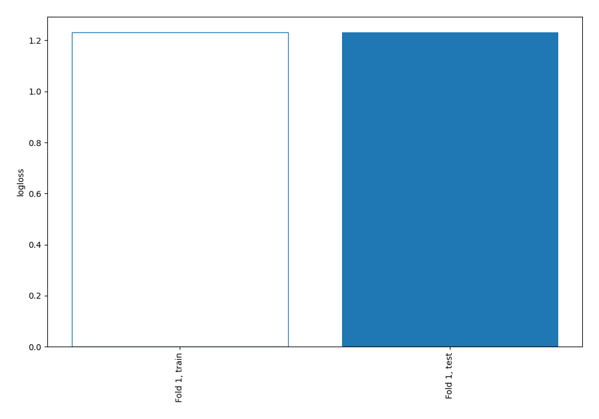
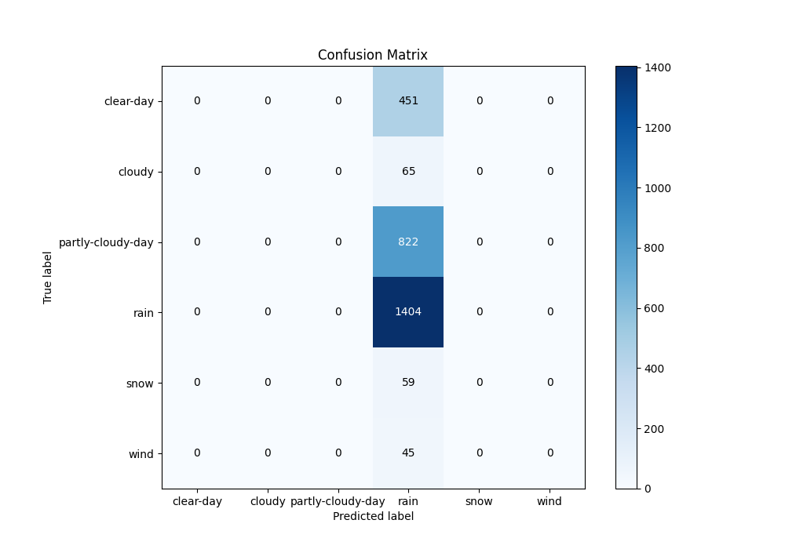
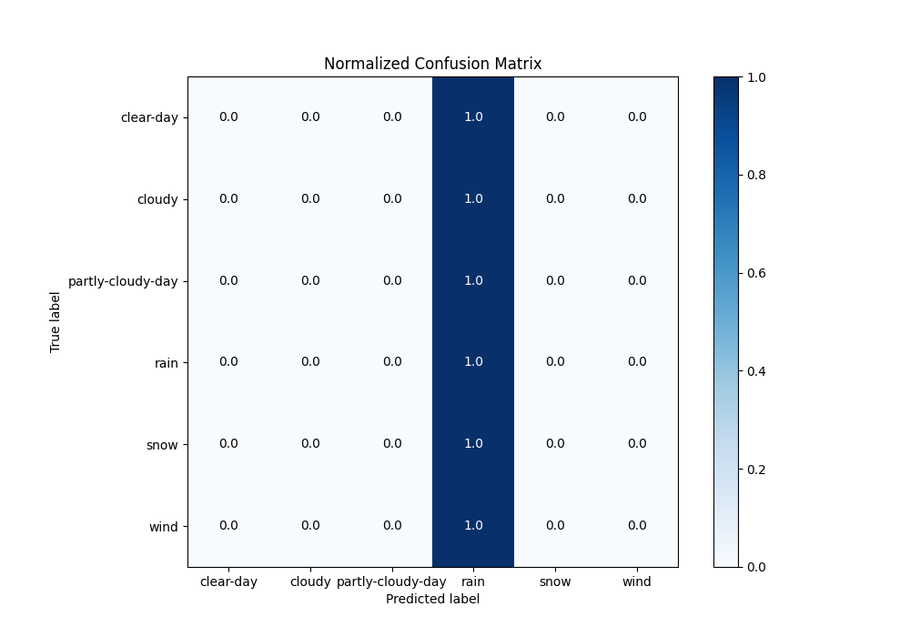
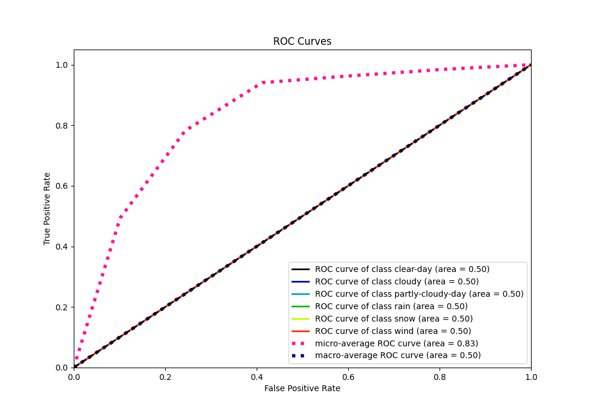
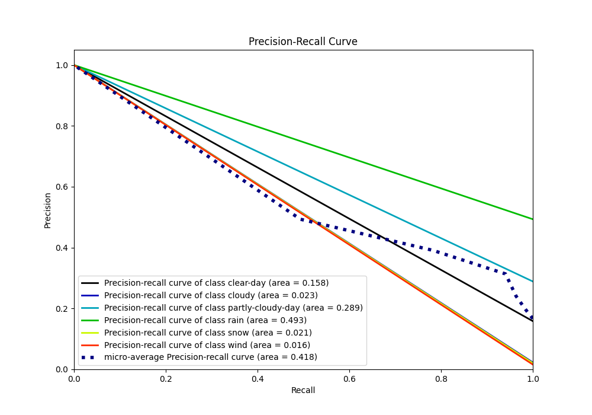

# Summary of 1_Baseline

[<< Go back](../README.md)

## Baseline Classifier (Baseline)
- **n_jobs**: -1
- **num_class**: 6
- **explain_level**: 2

## Validation
 - **validation_type**: split
 - **train_ratio**: 0.75
 - **shuffle**: True
 - **stratify**: True

## Optimized metric
logloss

## Training time

0.9 seconds

### Metric details
|           |   clear-day |   cloudy |   partly-cloudy-day |        rain |   snow |   wind |   accuracy |    macro avg |   weighted avg |   logloss |
|:----------|------------:|---------:|--------------------:|------------:|-------:|-------:|-----------:|-------------:|---------------:|----------:|
| precision |           0 |        0 |                   0 |    0.493324 |      0 |      0 |   0.493324 |    0.0822207 |       0.243369 |   1.23145 |
| recall    |           0 |        0 |                   0 |    1        |      0 |      0 |   0.493324 |    0.166667  |       0.493324 |   1.23145 |
| f1-score  |           0 |        0 |                   0 |    0.660706 |      0 |      0 |   0.493324 |    0.110118  |       0.325942 |   1.23145 |
| support   |         451 |       65 |                 822 | 1404        |     59 |     45 |   0.493324 | 2846         |    2846        |   1.23145 |

## Confusion matrix
|                              |   Predicted as clear-day |   Predicted as cloudy |   Predicted as partly-cloudy-day |   Predicted as rain |   Predicted as snow |   Predicted as wind |
|:-----------------------------|-------------------------:|----------------------:|---------------------------------:|--------------------:|--------------------:|--------------------:|
| Labeled as clear-day         |                        0 |                     0 |                                0 |                 451 |                   0 |                   0 |
| Labeled as cloudy            |                        0 |                     0 |                                0 |                  65 |                   0 |                   0 |
| Labeled as partly-cloudy-day |                        0 |                     0 |                                0 |                 822 |                   0 |                   0 |
| Labeled as rain              |                        0 |                     0 |                                0 |                1404 |                   0 |                   0 |
| Labeled as snow              |                        0 |                     0 |                                0 |                  59 |                   0 |                   0 |
| Labeled as wind              |                        0 |                     0 |                                0 |                  45 |                   0 |                   0 |

## Learning curves

## Confusion Matrix

## Normalized Confusion Matrix

## ROC Curve

## Precision Recall Curve

[<< Go back](../README.md)
