# Summary of 2_DecisionTree

[<< Go back](../README.md)

## Decision Tree
- **n_jobs**: -1
- **criterion**: gini
- **max_depth**: 3
- **num_class**: 6
- **explain_level**: 2

## Validation
 - **validation_type**: split
 - **train_ratio**: 0.75
 - **shuffle**: True
 - **stratify**: True

## Optimized metric
logloss

## Training time

4.3 seconds

### Metric details
|           |   clear-day |   cloudy |   partly-cloudy-day |        rain |   snow |   wind |   accuracy |   macro avg |   weighted avg |   logloss |
|:----------|------------:|---------:|--------------------:|------------:|-------:|-------:|-----------:|------------:|---------------:|----------:|
| precision |    0.561644 |        0 |            0.344008 |    0.636836 |      0 |      0 |    0.53338 |    0.257081 |       0.502528 |   1.04184 |
| recall    |    0.181818 |        0 |            0.405109 |    0.785613 |      0 |      0 |    0.53338 |    0.228757 |       0.53338  |   1.04184 |
| f1-score  |    0.274707 |        0 |            0.372067 |    0.703444 |      0 |      0 |    0.53338 |    0.225036 |       0.498021 |   1.04184 |
| support   |  451        |       65 |          822        | 1404        |     59 |     45 |    0.53338 | 2846        |    2846        |   1.04184 |

## Confusion matrix
|                              |   Predicted as clear-day |   Predicted as cloudy |   Predicted as partly-cloudy-day |   Predicted as rain |   Predicted as snow |   Predicted as wind |
|:-----------------------------|-------------------------:|----------------------:|---------------------------------:|--------------------:|--------------------:|--------------------:|
| Labeled as clear-day         |                       82 |                     0 |                              239 |                 130 |                   0 |                   0 |
| Labeled as cloudy            |                        0 |                     0 |                               57 |                   8 |                   0 |                   0 |
| Labeled as partly-cloudy-day |                       43 |                     0 |                              333 |                 446 |                   0 |                   0 |
| Labeled as rain              |                       21 |                     0 |                              280 |                1103 |                   0 |                   0 |
| Labeled as snow              |                        0 |                     0 |                               59 |                   0 |                   0 |                   0 |
| Labeled as wind              |                        0 |                     0 |                                0 |                  45 |                   0 |                   0 |

## Learning curves
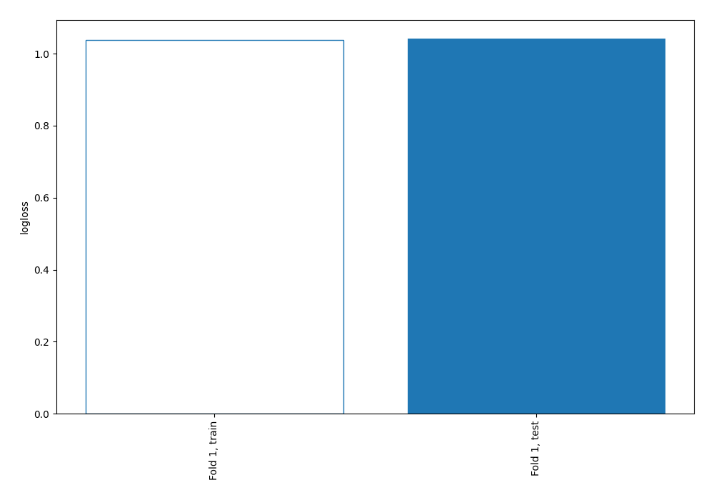

## Permutation-based Importance
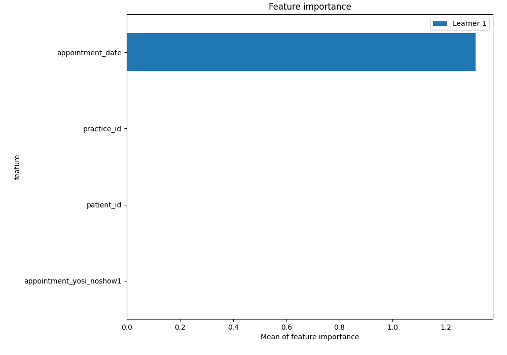
## Confusion Matrix

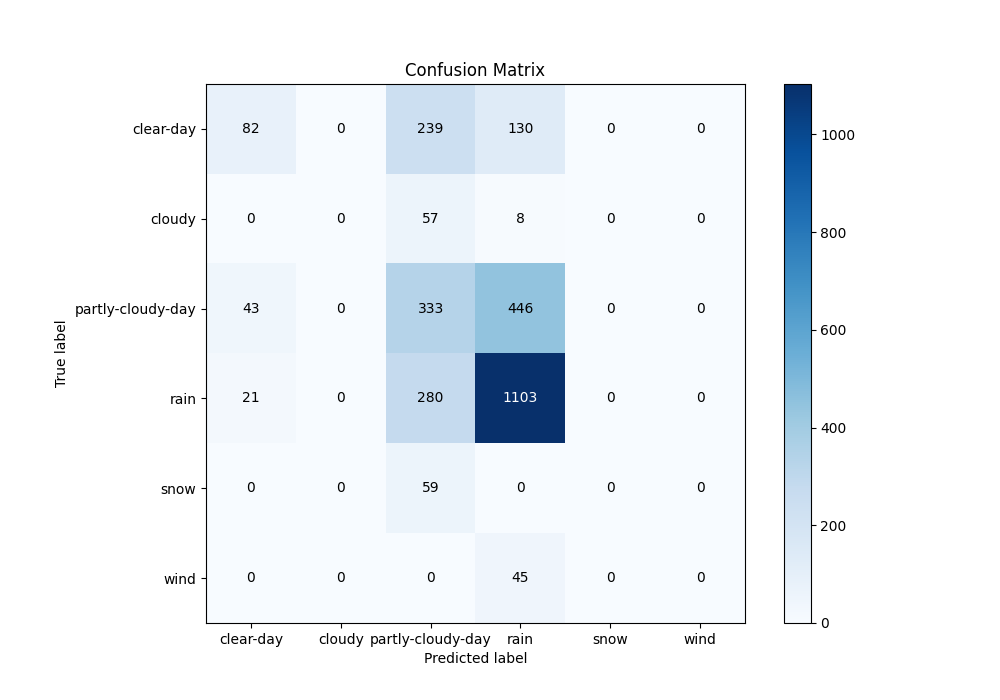

## Normalized Confusion Matrix

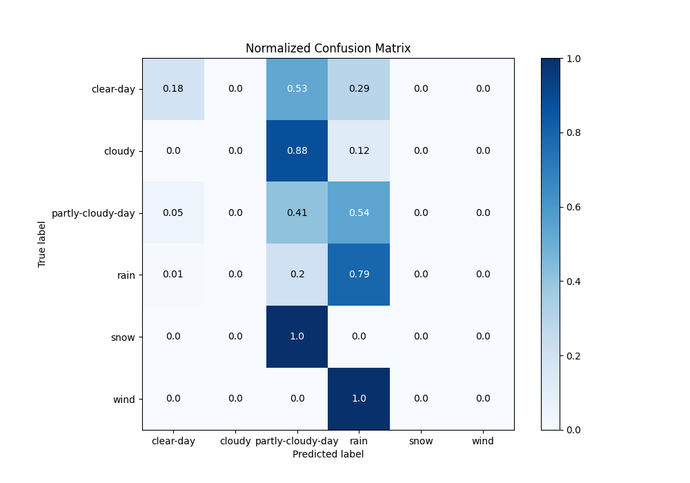

## ROC Curve

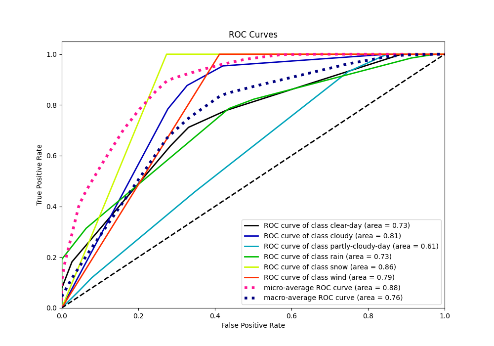

## Precision Recall Curve

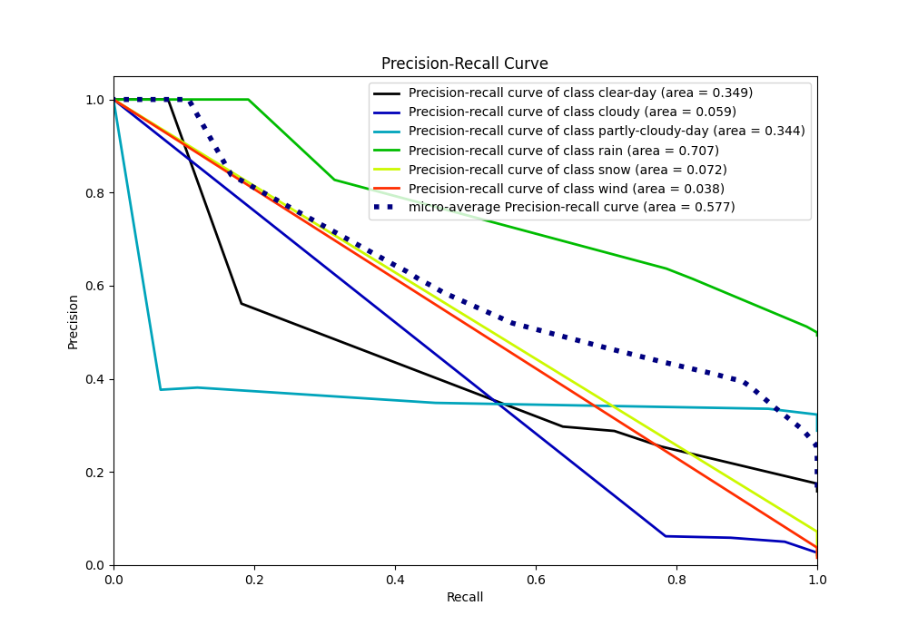

## SHAP Importance
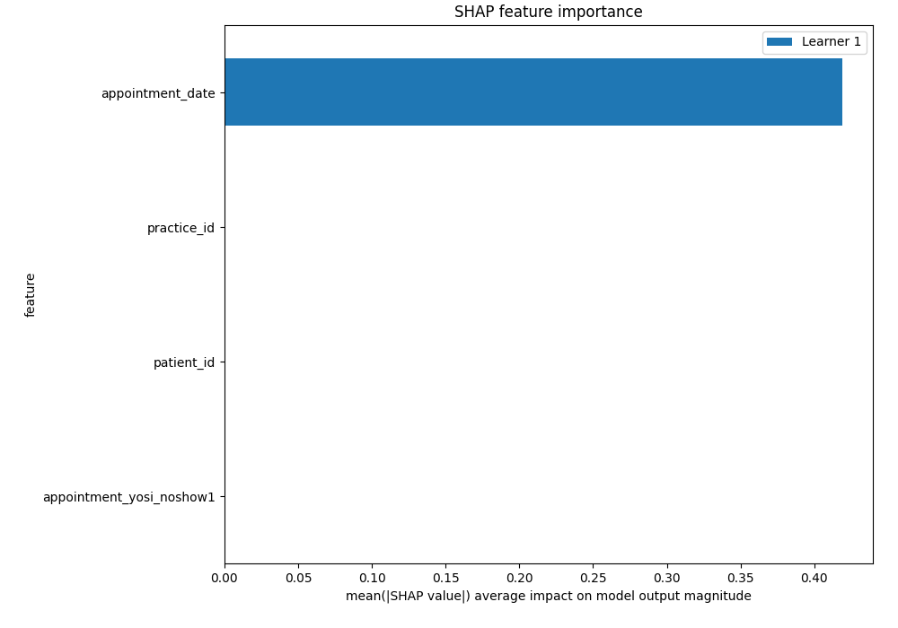

## SHAP Dependence plots

### Dependence clear-day (Fold 1)
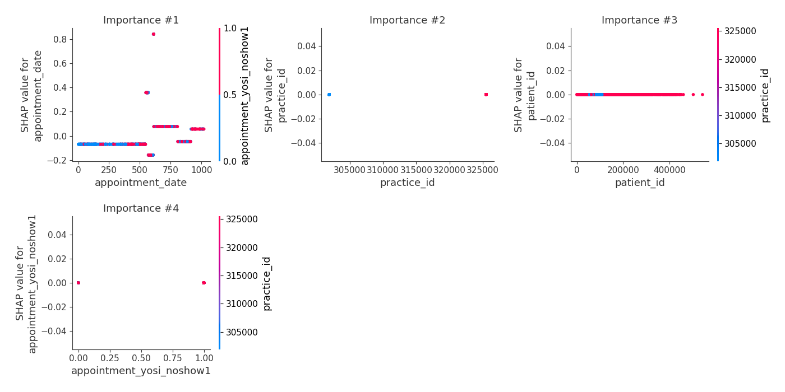
### Dependence cloudy (Fold 1)
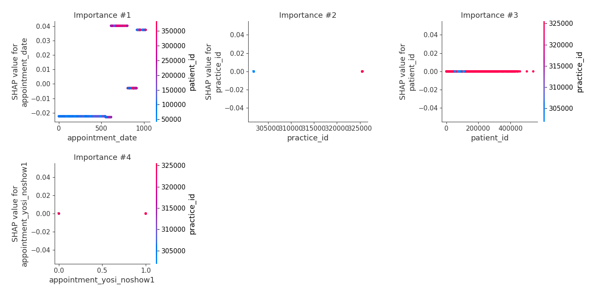
### Dependence partly-cloudy-day (Fold 1)
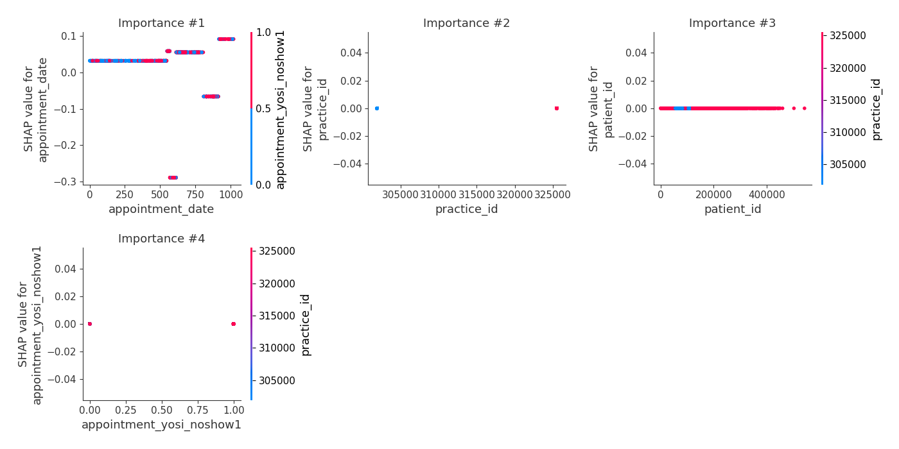
### Dependence rain (Fold 1)
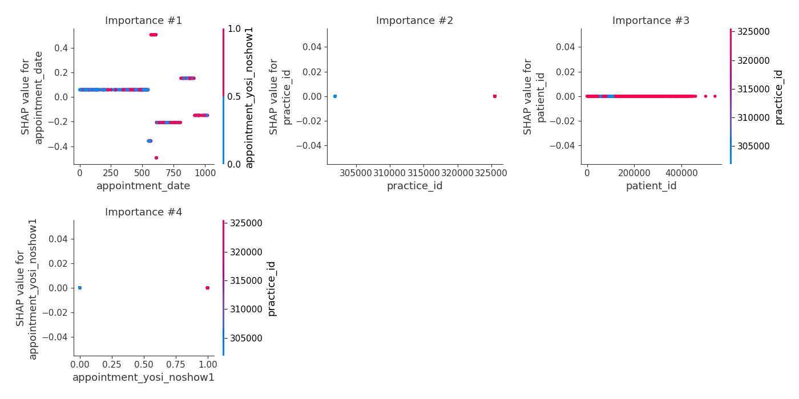
### Dependence snow (Fold 1)
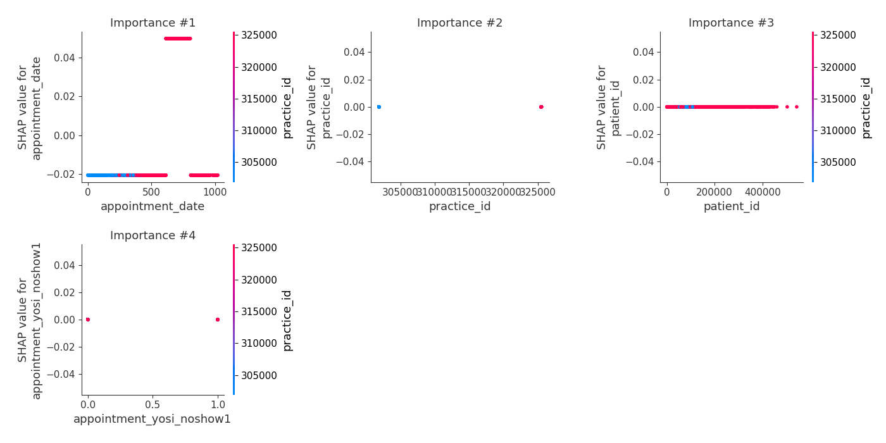
### Dependence wind (Fold 1)
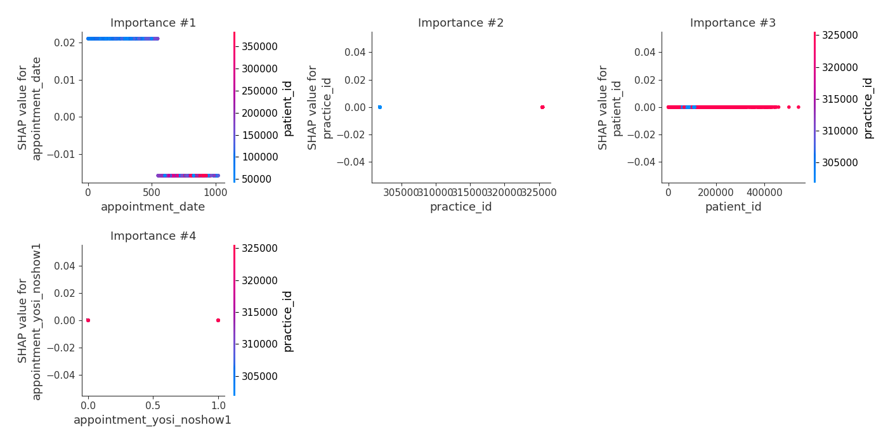

## SHAP Decision plots

### Worst decisions for selected sample 1 (Fold 1)
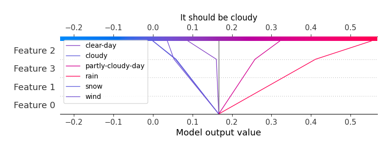
### Worst decisions for selected sample 2 (Fold 1)
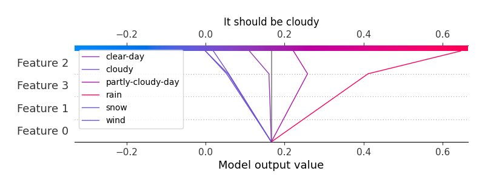
### Worst decisions for selected sample 3 (Fold 1)

### Worst decisions for selected sample 4 (Fold 1)

### Best decisions for selected sample 1 (Fold 1)

### Best decisions for selected sample 2 (Fold 1)

### Best decisions for selected sample 3 (Fold 1)
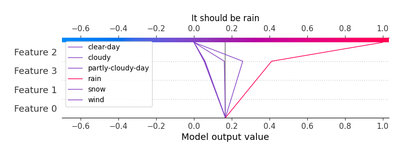
### Best decisions for selected sample 4 (Fold 1)

[<< Go back](../README.md)
