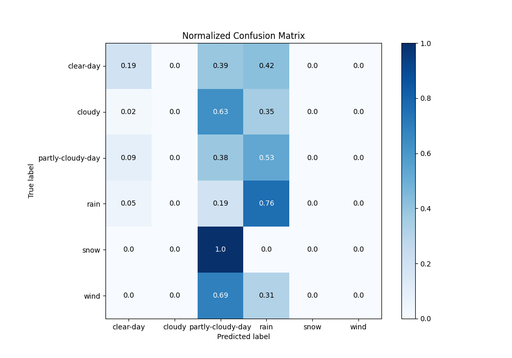

# Summary of 4_Default_NeuralNetwork

[<< Go back](../README.md)

## Neural Network
- **n_jobs**: -1
- **dense_1_size**: 32
- **dense_2_size**: 16
- **learning_rate**: 0.05
- **num_class**: 6
- **explain_level**: 2

## Validation
 - **validation_type**: split
 - **train_ratio**: 0.75
 - **shuffle**: True
 - **stratify**: True

## Optimized metric
logloss

## Training time

1.4 seconds

### Metric details
|           |   clear-day |   cloudy |   partly-cloudy-day |        rain |   snow |   wind |   accuracy |   macro avg |   weighted avg |   logloss |
|:----------|------------:|---------:|--------------------:|------------:|-------:|-------:|-----------:|------------:|---------------:|----------:|
| precision |    0.375    |        0 |            0.353478 |    0.617156 |      0 |      0 |   0.516163 |    0.224272 |       0.465977 |   1.04919 |
| recall    |    0.192905 |        0 |            0.377129 |    0.763533 |      0 |      0 |   0.516163 |    0.222261 |       0.516163 |   1.04919 |
| f1-score  |    0.254758 |        0 |            0.364921 |    0.682585 |      0 |      0 |   0.516163 |    0.217044 |       0.482505 |   1.04919 |
| support   |  451        |       65 |          822        | 1404        |     59 |     45 |   0.516163 | 2846        |    2846        |   1.04919 |

## Confusion matrix
|                              |   Predicted as clear-day |   Predicted as cloudy |   Predicted as partly-cloudy-day |   Predicted as rain |   Predicted as snow |   Predicted as wind |
|:-----------------------------|-------------------------:|----------------------:|---------------------------------:|--------------------:|--------------------:|--------------------:|
| Labeled as clear-day         |                       87 |                     0 |                              175 |                 189 |                   0 |                   0 |
| Labeled as cloudy            |                        1 |                     0 |                               41 |                  23 |                   0 |                   0 |
| Labeled as partly-cloudy-day |                       73 |                     0 |                              310 |                 439 |                   0 |                   0 |
| Labeled as rain              |                       71 |                     0 |                              261 |                1072 |                   0 |                   0 |
| Labeled as snow              |                        0 |                     0 |                               59 |                   0 |                   0 |                   0 |
| Labeled as wind              |                        0 |                     0 |                               31 |                  14 |                   0 |                   0 |

## Learning curves

## Permutation-based Importance

## Confusion Matrix

## Normalized Confusion Matrix

## ROC Curve

## Precision Recall Curve

[<< Go back](../README.md)
