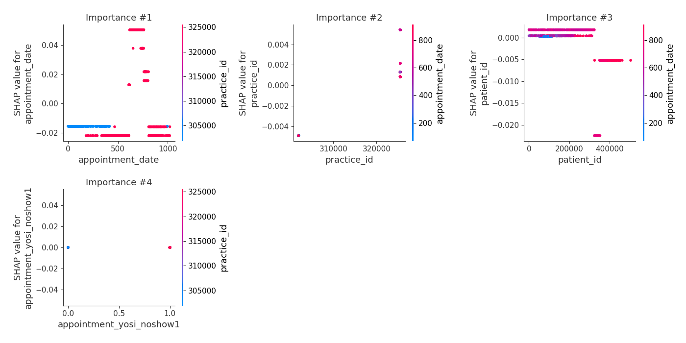
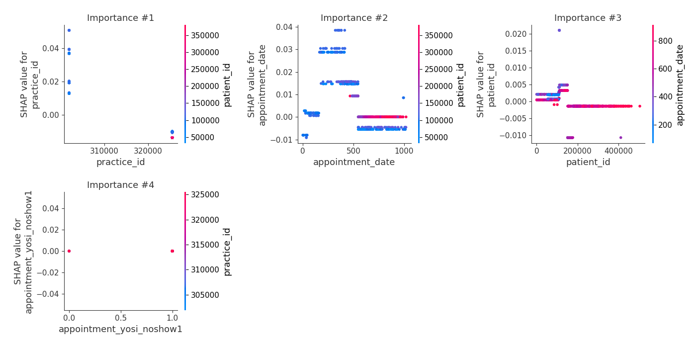

# Summary of 5_Default_RandomForest

[<< Go back](../README.md)

## Random Forest
- **n_jobs**: -1
- **criterion**: gini
- **max_features**: 0.9
- **min_samples_split**: 30
- **max_depth**: 4
- **eval_metric_name**: logloss
- **num_class**: 6
- **explain_level**: 2

## Validation
 - **validation_type**: split
 - **train_ratio**: 0.75
 - **shuffle**: True
 - **stratify**: True

## Optimized metric
logloss

## Training time

3.6 seconds

### Metric details
|           |   clear-day |   cloudy |   partly-cloudy-day |        rain |   snow |   wind |   accuracy |   macro avg |   weighted avg |   logloss |
|:----------|------------:|---------:|--------------------:|------------:|-------:|-------:|-----------:|------------:|---------------:|----------:|
| precision |    0.698276 |        0 |            0.37193  |    0.630933 |      0 |      0 |   0.555868 |    0.283523 |       0.529332 |  0.990921 |
| recall    |    0.179601 |        0 |            0.386861 |    0.842593 |      0 |      0 |   0.555868 |    0.234842 |       0.555868 |  0.990921 |
| f1-score  |    0.285714 |        0 |            0.379249 |    0.721561 |      0 |      0 |   0.555868 |    0.231087 |       0.510777 |  0.990921 |
| support   |  451        |       65 |          822        | 1404        |     59 |     45 |   0.555868 | 2846        |    2846        |  0.990921 |

## Confusion matrix
|                              |   Predicted as clear-day |   Predicted as cloudy |   Predicted as partly-cloudy-day |   Predicted as rain |   Predicted as snow |   Predicted as wind |
|:-----------------------------|-------------------------:|----------------------:|---------------------------------:|--------------------:|--------------------:|--------------------:|
| Labeled as clear-day         |                       81 |                     0 |                              207 |                 163 |                   0 |                   0 |
| Labeled as cloudy            |                        3 |                     0 |                               46 |                  16 |                   0 |                   0 |
| Labeled as partly-cloudy-day |                       20 |                     0 |                              318 |                 484 |                   0 |                   0 |
| Labeled as rain              |                       12 |                     0 |                              209 |                1183 |                   0 |                   0 |
| Labeled as snow              |                        0 |                     0 |                               59 |                   0 |                   0 |                   0 |
| Labeled as wind              |                        0 |                     0 |                               16 |                  29 |                   0 |                   0 |

## Learning curves

## Permutation-based Importance

## Confusion Matrix

## Normalized Confusion Matrix

## ROC Curve

## Precision Recall Curve

## SHAP Importance

## SHAP Dependence plots

### Dependence clear-day (Fold 1)

### Dependence cloudy (Fold 1)

### Dependence partly-cloudy-day (Fold 1)

### Dependence rain (Fold 1)

### Dependence snow (Fold 1)

### Dependence wind (Fold 1)

## SHAP Decision plots

### Worst decisions for selected sample 1 (Fold 1)

### Worst decisions for selected sample 2 (Fold 1)

### Worst decisions for selected sample 3 (Fold 1)

### Worst decisions for selected sample 4 (Fold 1)

### Best decisions for selected sample 1 (Fold 1)

### Best decisions for selected sample 2 (Fold 1)

### Best decisions for selected sample 3 (Fold 1)

### Best decisions for selected sample 4 (Fold 1)

[<< Go back](../README.md)
