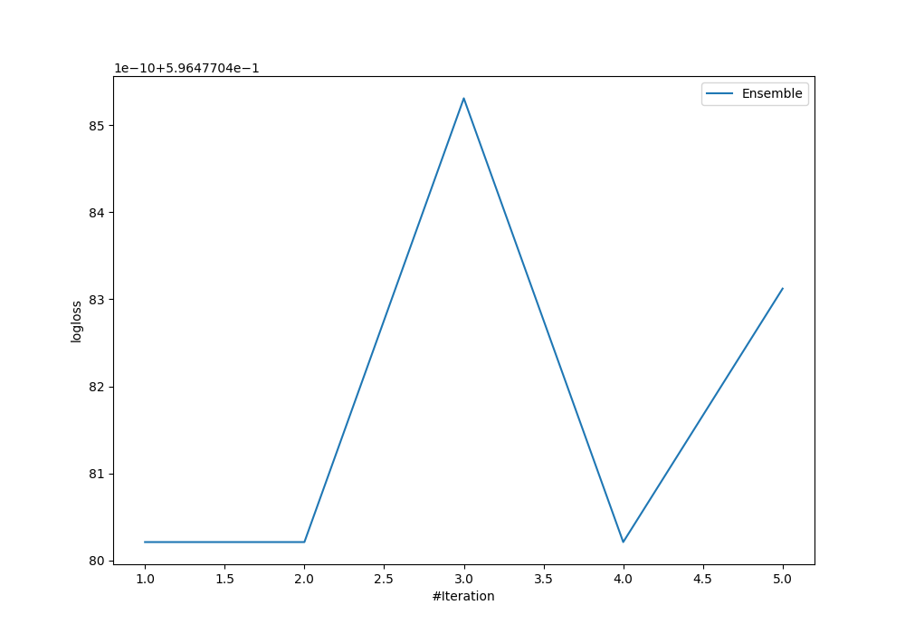
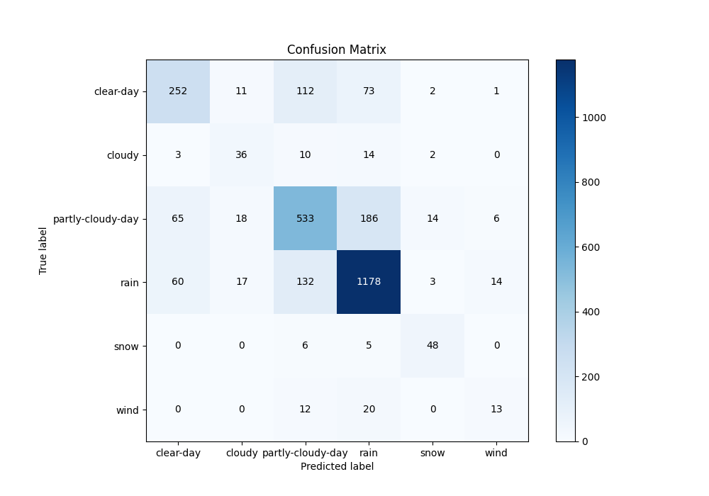
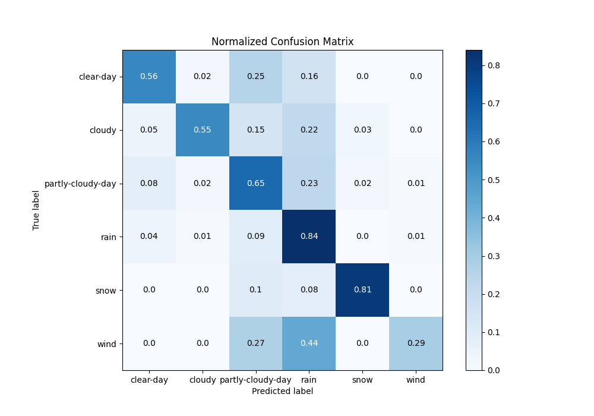
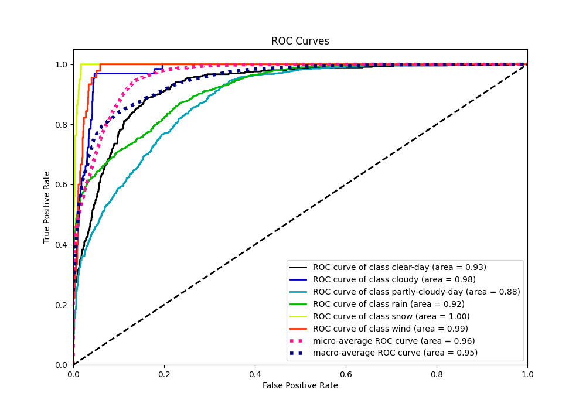
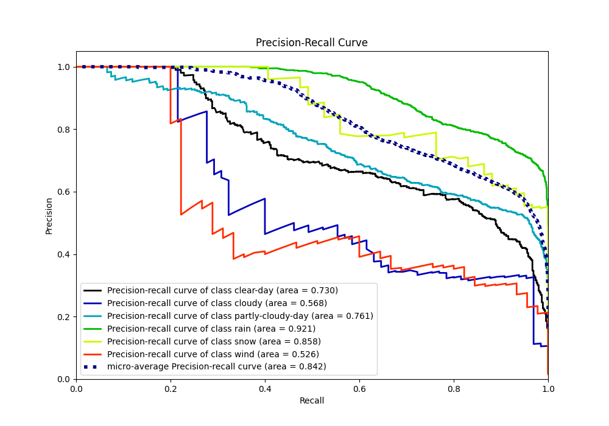

# Summary of Ensemble

[<< Go back](../README.md)

## Ensemble structure
| Model             |   Weight |
|:------------------|---------:|
| 3_Default_Xgboost |        1 |

### Metric details
|           |   clear-day |    cloudy |   partly-cloudy-day |        rain |      snow |      wind |   accuracy |   macro avg |   weighted avg |   logloss |
|:----------|------------:|----------:|--------------------:|------------:|----------:|----------:|-----------:|------------:|---------------:|----------:|
| precision |    0.663158 |  0.439024 |            0.662112 |    0.798103 |  0.695652 |  0.382353 |   0.723823 |    0.606734 |       0.720542 |  0.596477 |
| recall    |    0.558758 |  0.553846 |            0.648418 |    0.839031 |  0.813559 |  0.288889 |   0.723823 |    0.617084 |       0.723823 |  0.596477 |
| f1-score  |    0.606498 |  0.489796 |            0.655194 |    0.818056 |  0.75     |  0.329114 |   0.723823 |    0.60811  |       0.720853 |  0.596477 |
| support   |  451        | 65        |          822        | 1404        | 59        | 45        |   0.723823 | 2846        |    2846        |  0.596477 |

## Confusion matrix
|                              |   Predicted as clear-day |   Predicted as cloudy |   Predicted as partly-cloudy-day |   Predicted as rain |   Predicted as snow |   Predicted as wind |
|:-----------------------------|-------------------------:|----------------------:|---------------------------------:|--------------------:|--------------------:|--------------------:|
| Labeled as clear-day         |                      252 |                    11 |                              112 |                  73 |                   2 |                   1 |
| Labeled as cloudy            |                        3 |                    36 |                               10 |                  14 |                   2 |                   0 |
| Labeled as partly-cloudy-day |                       65 |                    18 |                              533 |                 186 |                  14 |                   6 |
| Labeled as rain              |                       60 |                    17 |                              132 |                1178 |                   3 |                  14 |
| Labeled as snow              |                        0 |                     0 |                                6 |                   5 |                  48 |                   0 |
| Labeled as wind              |                        0 |                     0 |                               12 |                  20 |                   0 |                  13 |

## Learning curves

## Confusion Matrix

## Normalized Confusion Matrix

## ROC Curve

## Precision Recall Curve

[<< Go back](../README.md)
